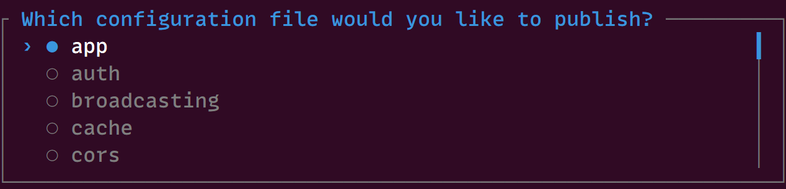

# Estructura de directorios en Laravel 11
Laravel 11 trae una serie de cambios importantes a nivel de estructura de directorios y archivos, básicamente pasamos de 217 en un proyecto con Laravel 10 a 148 archivos en un proyecto con Laravel 11.

Por suerte para nosotros, la nueva estructura y forma de hacer de Laravel 11 es opcional y no necesitaremos actualizar nuestros proyectos a la nueva versión aplicando esta nueva estructura de directorios, un gran alivio y algo que tiene todo el sentido, no podía ser de otra forma.

## Estructura raíz de un proyecto Laravel 11
Si miramos la estructura raíz de directorios de un nuevo proyecto Laravel 11 veremos que es lo mismo de siempre, sin sorpresas.

### El directorio app
Sin duda es el directorio que más cambios ha sufrido en Laravel 11. Si antes teníamos los directorios Exceptions, Console y dentro de éstos más directorios como Commands o archivos como los Kernels, todo eso ahora ha desaparecido, o más bien, Laravel lo ha ocultado, ¿motivo? Para mí sigue siendo un misterio, creo que esos directorios y archivos no eran algo que molestara a los desarrolladores Laravel, al fin y al cabo, siempre podemos prescindir de ellos si no los necesitamos.

En Laravel 11, lo único que tenemos por defecto en el directorio app es lo siguiente:
* Http
    * Controllers
 * Models
 * Providers
  
Está bien, tenemos lo necesario, pero, por ejemplo, el Kernel HTTP no era algo que personalmente me molestara, todo lo contrario, siempre ha sido un archivo muy útil para la configuración de Middlewares para las peticiones HTTP.

### En el directorio bootstrap
Un directorio al que yo personalmente nunca he prestado demasiada atención, y que el equipo de Laravel ha decidido poner en primer plano para darle la importancia que merece, al fin y al cabo, aquí se encuentra el archivo app.php, el cual siempre ha sido el que ha hecho el lanzamiento de la aplicación Laravel como tal, ¿por qué no?
Laravel 11 tiene pensado que configuremos nuestra aplicación manualmente a través del archivo **bootstrap/app.php**. Personalmente, este cambio me ha chocado, pero hay que darle una oportunidad, hemos de reconocer que llevamos demasiado tiempo trabajando de la misma forma y por naturaleza los cambios siempre traen turbulencias.

### En el directorio config
Bueno, aquí ya se ha rizado el rizo, y Taylor Otwell, ni corto ni perezoso, junto con su equipo, se han dicho, el que necesite alguna configuración, que haga como hacen los paquetes que se instalan en proyectos Laravel, ¡que los publique! Y para ello, Laravel 11 añade el nuevo comando config:publish, el cual, al ejecutarlo, mostrará un prompt con todas las opciones posibles de configuración.



Con esto básicamente te vengo a decir que el directorio config está completamente vacío, si quieres algo, pues lo publicas.

### En el directorio database
El directorio database es más o menos el mismo. Sin embargo, los nombres de los archivos de migración tienen un prefijo que no representa una fecha determinada, sino que los mantiene en orden según sea necesario. El archivo de migración create_personal_access_tokens.php ya no está en el proyecto. Los tokens de acceso personal solo son necesarios si crea una API, que cubriremos en los cambios en el directorio routes más adelante.

Además, **el archivo database.sqlite** se instalará de forma predeterminada a menos que elijamos una opción de base de datos diferente al crear un nuevo proyecto Laravel.

### En el directorio routes
El directorio routes también se ha reducido para incluir solo los archivos de rutas web.php y console.php. Si queremos crear una API o utilizar la funcionalidad de broadcasting, podemos instalarlos a través de artisan:

```php
php artisan install:api
php artisan install:broadcasting
```
Esos comandos incluirán las migraciones, el código JavaScript y los archivos de configuración necesarios. Lo bueno de esto es que las aplicaciones que no necesitan broadcasting o rutas API no tienen que preocuparse de que estos archivos innecesarios estén en el proyecto.

### En el directorio tests

El directorio tests/ ya no incluye el trait CreatesApplication en los proyectos de Laravel 11. Si actualizas tu proyecto Laravel 10, puedes eliminar este trait, ya que ahora se proporciona como parte del TestCase base del framework.

En un proyecto de Laravel 10, lo único que se incluye en la clase base TestCase en Laravel 10 es el trait CreatesApplication, que arranca la aplicación al crear una nueva aplicación como parte de la configuración antes de cada prueba. Puedes eliminar de forma segura este trait(y su uso) una vez que actualices tus aplicaciones existentes a Laravel 11.

Resumiendo, Laravel 11 ofrece muchos menos archivos de base y hace cambios en cómo debemos configurar nuestras aplicaciones, deberemos familiarizarnos con esta nueva forma y poner la mejor de nuestras sonrisas, sin duda todo esto será bueno para nosotros y para Laravel.
