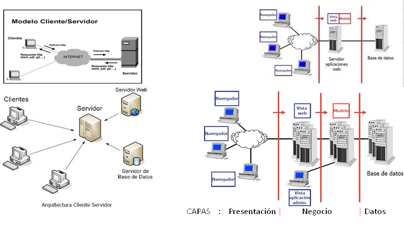
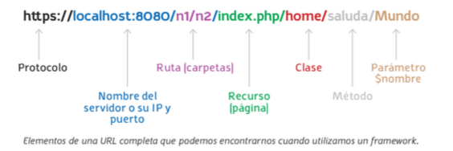
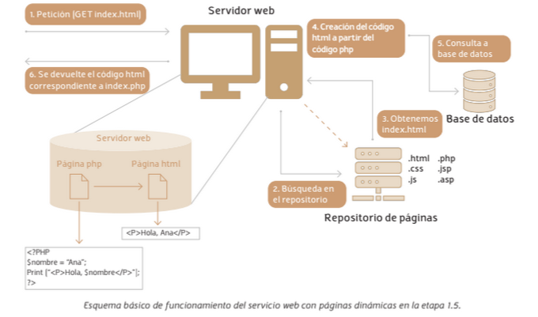
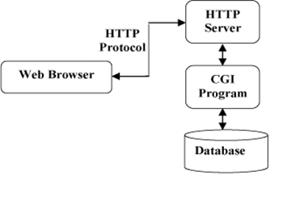
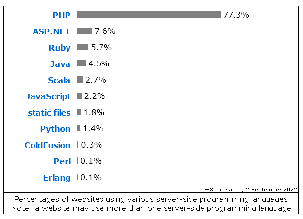
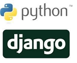
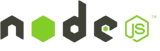
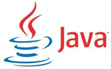
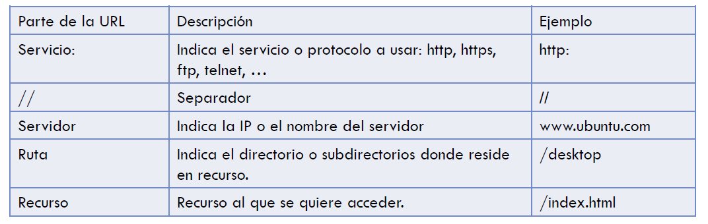

# UT1 SELECCIÓN DE ARQUITECTURAS Y HERRAMIENTAS DE PROGRAMACIÓN
## Índice
  
- [UT1 SELECCIÓN DE ARQUITECTURAS Y HERRAMIENTAS DE PROGRAMACIÓN](#ut1-selección-de-arquitecturas-y-herramientas-de-programación)
  - [Índice](#índice)
  - [Conceptos básicos de Internet](#conceptos-básicos-de-internet)
  - [Introducción](#introducción)
  - [Arquitecturas de las aplicaciones web](#arquitecturas-de-las-aplicaciones-web)
    - [Aplicaciones web cliente-servidor](#aplicaciones-web-cliente-servidor)
    - [Aplicaciones web de tres capas](#aplicaciones-web-de-tres-capas)
    - [Aplicaciones web con más de tres capas](#aplicaciones-web-con-más-de-tres-capas)
  - [Tipos de aplicaciones web](#tipos-de-aplicaciones-web)
  - [Lenguajes de programación utilizados.  Lenguajes de scripting](#lenguajes-de-programación-utilizados--lenguajes-de-scripting)
    - [Del lado del cliente](#del-lado-del-cliente)
    - [Lenguajes del lado del servidor](#lenguajes-del-lado-del-servidor)
  - [Integración con los servidores web](#integración-con-los-servidores-web)
  - [Herramientas de programación](#herramientas-de-programación)

## Conceptos básicos de Internet
* Es una gran red de ordenadores y como todas ellas  sirve para compartir recursos e intercambiar  información.
* Ordenadores unidos a través de conexiones de varios  tipos
* Se utiliza el protocolo TCP/IP
* Se ofrecen diferentes servicios a los usuarios: WWW,  FTP, DNS, e-mail, SSH, etc…

## Introducción
* Una web es un sistema formado por volúmenes de información organizados  mediante recursos web (enlaces, vínculos que permiten relacionarse entre  ellos…).
* Surge como idea original para la búsqueda de un sistema que permita  acceder rápidamente a documentos electrónicos mediante enlaces.
* Se utiliza un lenguaje denominado HTML (HyperText Markup Language).
* HTML es el lenguaje con el que se "escriben" la mayoría de páginas Web.
* El lenguaje HTML es un estándar reconocido en todo el mundo y cuyas  normas define un organismo sin ánimo de lucro llamado [World Wide Web  Consortium](http://www.w3.org) más conocido como W3C.
* El software para comprender e interpretar la información en un documento  HTML se denomina navegador.

## Arquitecturas de las aplicaciones web

### Aplicaciones web cliente-servidor
Las aplicaciones cliente-servidor están divididas en dos niveles o capas. Ambas funcionarán a través de internet y la parte cliente irá solicitando recursos a la parte servidor. En la url podemos utilizar diferentes protocolos de comunicación de la familia TCP/IP.
Por ejemplo, el protocolo DNS es un serviciode ua base de datos distribuida que contiene información de cada dominio. Su función principal es dar la IP pública de un dominio. Su gestión está delegada sobre diferentes empresas a nivel mundial. En el mundo, hay miles de servidores DNS escuchando por su puerto 53(a través de TCP o UDP) las peticiones de los millones de clientes que requieran conocer la IP pública del dominio al que quieren acceder para encontrar dicho servidor web.
* __El servidor web__ es un proceso pasivo, ya que solo contesta si algún cliente le solicita algún recurso. Dichas solicitudes llegan, mayoritariamente, a través de los protocolos HTTP/HTTPS
Los servidores web más utilizados son:
  * Privativos: Internet Information Services (IIS) de Microsoft, o el WebLogicServer de Oracle.
  * Proyectos de código abierto (open source): Servidor Apache, el Lighttpd o NginX.

* __La capa cliente__ es un proceso activo, que son los consumidores de servicios de la parte servidora. El usuario interactuará a través de las aplicaciones web, para ir pidiendo la información que va necesitando visualizar en cada momento.

### Aplicaciones web de tres capas
Son una evolución de la arquitectura cliente-servidor. Implementa una división mayor de funcionalidades en las diferentes capas. El servidor se desdobla para trabajar con estas tres capas:
* __Capa de presentación__ (front-end): Es la que ven y utilizan los usuarios o clientes, que ha de verse bien en todos los navegadores de manera adaptativa (responsive) con diferentes tamaños de pantalla, en todo tipo de dispositivos electrónicos.
* __Capa de negocio o de lógica__ (back-end): Es la capa que conoce y gestiona las funcionalidades que esperamos del sistema o aplicación web. Conoce el modelo o la lógica del negocio o servicio que queremos dar, corresponde al servidor de aplicaciones. No obstante, cada vez existen más tendencias de dividirlo en microservicios, serverless o servicios en la nube. 
* __Capa de persistencia o de datos__: Es la capa donde residen los datos y la encargada de acceder a ellos. En este modelo de tres capas, reside en un servidor específico y especializado para ella. Permite centralizar los datos, y que estos sean accesibles desde más de uno o varios servidores web. Basicamente, su función es entregar los datos que le pida la capa intermedia, es decir, el servidor de aplicaciones.
  
### Aplicaciones web con más de tres capas
Las cuatro capas típicas en una arquitectura de cuatro capas son las siguientes:
* __Capa de presentación__: Esta es la capa que interactúa directamente con el usuario. Es responsable de la interfaz de usuario, la presentación de datos y la gestión de la interacción del usuario. Aquí es donde se encuentran las vistas y controladores que permiten al usuario interactuar con la aplicación.
  
* __Capa de control__: Esta capa maneja las solicitudes del usuario y coordina las acciones necesarias para procesar esas solicitudes. Puede incluir la lógica de navegación y la gestión de flujos de trabajo.

* __Capa de servicios o negocio__: Esta capa actúa como intermediario entre la capa de control y la capa de datos. Contiene la lógica de negocio de la aplicación, realiza cálculos, procesa datos y coordina la interacción entre múltiples modelos o componentes de datos. Puede proporcionar servicios reutilizables para la aplicación.

* __Capa de datos__: En esta capa se gestionan los datos y la interacción con el almacenamiento de datos. Puede incluir bases de datos, sistemas de archivos, servicios web, API, etc. Esta capa se encarga de la persistencia y recuperación de datos.

Con los microservicios, actualmente se puede llegar a arquitecturas hexagonales con hasta seis capas diferentes. Más información sobre [la arquitectura hexagonal](https://openwebinars.net/blog/que-es-la-arquitectura-hexagonal/)

## Tipos de aplicaciones web
Podemos dividir las __aplicaciones web__ en:
* __Estáticas__: el usuario recibe una página web cuya interacción no conlleva ningún tipo de acción, ni en la propia página, ni genera respuesta alguna por parte del servidor. Usan lenguaje HTML exclusivamente. Es la web 1.0 duró aproximadamente ocho años hasta la aparición del html 4.0 en 1988.
  
* __Dinámicas__: la interacción del cliente con el recurso recibido por parte  del servidor (página web) produce algún tipo de cambio en la  visualización del mismo (cambios de formato, ocultación de partes del documento, creación de elementos nuevos, etc.). Los lenguajes  involucrados en este tipo de aplicaciones incluyen, entre otros, HTML, CSS o JavaScript. Es la web 1.5 dinámicas se utilizaron durante seis años, hasta 2003. Estaban escritas en lenguajes de programación del lado servidor como PHP, ASP.net o JSP, que se ejecutan en el servidor de aplicaciones web.
El servidor web procesará la petición e irá construyendo la página web en HTML de forma dinámica para contestar al cliente.
. 
Las páginas web dinámicas se personalizan y adaptan la información que muestran a partir de la información recibida en la misma petición o mediante consultas a bases de datos. Lo habitual será que una misma página devuelva resultados diferentes para usuarios diferentes, según los parámetros recibidos.

. 
  
* __Interactivas o híbridas__: la interacción hace que se genere un diálogo entre el cliente y el servidor. Desde el punto de vista del modelo de programación, la lógica asociada al inicio y gestión de dicho diálogo  puede ser ejecutada tanto en el cliente como en el servidor (e incluso en  ambos). 
Las más demandadas actualmente son las interactivas. Las tecnologías implicadas varían mucho en función de si son ejecutadas en el lado del cliente o en el lado del servidor. Ofrecen una experiencia de usuario altamente interactiva y suelen utilizar tecnologías web modernas, como AJAX (Asynchronous JavaScript and XML), para actualizar partes de la página sin necesidad de recargarla por completo. Las aplicaciones web interactivas pueden incluir características como formularios en línea, juegos, aplicaciones de productividad en tiempo real y redes sociales. Responden de manera inmediata a las acciones del usuario y suelen aprovechar JavaScript y otras tecnologías para crear experiencias altamente dinámicas. Es la web 2.0 hasta 2014 con la llegada del estandar HTML5, social media y Web 3.0

## Lenguajes de programación utilizados.  Lenguajes de scripting

Hay que diferenciar entre:
* Lenguajes de programación del lado del cliente.
* Lenguajes	de	programación del lado del lado del servidor o lenguajes scripting.

### Del lado del cliente

* __HTML__: solo presenta texto en una página, además de definir algunos aspectos visuales en el documento mediante el uso de estilos.
* __Hojas de estilo (CSS)__: definen reglas de representación del contenido en  colaboración con HTML.
* __JavaScript__: lenguaje de programación interpretado, permite el uso de efectos  visuales y nuevas interacciones con el usuario. Se usa habitualmente a través de  bibliotecas como jQuery, Angular o React.
* __XML__: lenguaje de programación auto descriptivo ampliamente utilizado para  el intercambio de datos entre aplicaciones multiplataforma.
* __JSON__: surge como el gran rival del XML ya que es más ligero y legible.
* __Applets__: programas desarrollados en Java (no recomendado).
* __ActiveX__: controles que tienen un comportamiento parecido a los applets pero son desarrollados por Microsoft (no recomendado).
* __Adobe Flash__ (problemas de usabilidad).

### Lenguajes del lado del servidor
El código de los lenguajes del lado	del	servidor es	ejecutado por un software específico en el componente que actúa como servidor.
Existen múltiples alternativas:
* CGIs
* Lenguajes específicos para web: PHP
* Lenguajes dinámicos: Perl, Python, Ruby,…
* JavaScript en servidor: NodeJS
* Lenguajes generados compilados:
    * JVM: Java (JSP, Servlets, …), Scala, Groovy
    * CLR: C# (ASP.NET), …
* Otros: frameworks, CMS, etc.

* __CGI__ (Common Gateway Interface), 1.1 (2004)
    * Método estándar para transmitir parámetros entre servidor y programas ejecutables
    * Los programas CGIs son ejecutados por el servidor
    * Devuelve la respuesta de la ejecución
    * Problemas de escalabilidad y seguridad

*  __PHP__  
    * Lenguaje interpretado por el servidor
    * El código se incrusta en HTML mediante  marcas especiales
    * Cuando el servidor reconoce código  PHP:
        * Llama al intérprete
        * Ejecuta el código
        * Devuelve el resultado
    * Según [__w3techs__](https://w3techs.com/technologies/overview/programming_language/all), el 77% de los sitios web utiliza PHP

* __Lenguajes dinámicos__
    * Python, Ruby
    * Lenguajes interpretados de propósito general
    * Buenos frameworks y librerías para Web
        * Ruby: Ruby on Rails
        * Python: Django
  
  
* __JavaScript del lado del servidor__
    * Librería Node.js
        * Basado V8, el motor JavaScript de Google
        * Permite utilizar JavaScript en el servidor
        * Entrada/salida basada en eventos
        * Creciendo en popularidad

 

* __Lenguajes generales compilados__
    * Java (JVM)
        * Máquina virtual de Java
        * Empotrado: JSP
        * Servlets y Contenedores de aplicaciones: Tomcat
        * Otros lenguajes sobre JVM: Scala, Groovy, ...
    * ASP .NET
        * Basado en CLR
            * Máquina virtual de C#
        * ASP Permite empotrar lenguaje en HTML
            * Extensión  aspx <% .... código %>
        * Diversos frameworks: ASP.Net  MVC
    * Otros lenguajes:
        * VB.Net, ...
  
  

* __Frameworks__: es un conjunto de bibliotecas de código que nos permite desarrollar aplicaciones web más agilmente.
  
    * Normalmente basados en el patrón MVC
        * Separación de modelo, vista, controlador
    * Numerosos frameworks
        * __PHP: Laravel__, Symfony, CakePHP, Zend
        * Ruby: Ruby on Rails
        * Python: Django, Zope
        * Java: Spring MVC, Play
        * Scala: Play, Lift
        * Groovy: Grails
        * Haskell: Yesod

## Integración con los servidores web
* Los clientes hacen peticiones a los servidores.
    * En ellas tienen que constar de unos elementos	concretos y especificados en un orden determinado.
    *   Las	direcciones	de las peticiones suelen ser de	tipo URL(Localizador Uniforme de Recurso):
        * Cadena de texto que se utiliza para identificar un recurso y además nos da información sobre como acceder a él, como localizarlo.
    * Formato URL:
  
 * Existen distintos modos o métodos para intercambiar información entre cliente y servidor:
    * __Método GET__: petición de información 
        * GET consultatelefono.php?cliente=empresa1 
        * Los parámetros se pasan como pares nombre=valor 
        * Se pueden pasar varios parámetros seguidos con &
    * __Método POST__: 
        * Se usa habitualmente para enviar información a un servidor web. 
            * Enviar el contenido de un formulario de autenticación
            * Entradas de datos
            * Especificar parámetros para algún tipo de componente ejecutado en el servidor.

## Herramientas de programación
* __Navegadores__
* __Editores de documentos__: este grupo está formado por editores de texto que permiten escribir código HTML directamente, sin ninguna ayuda ni facilidad adicional.
* __Entornos de programación__: entornos integrados que nos permiten editar, compilar y ejecutar los programas generados a partir de diferentes lenguajes usados en el desarrollo de las aplicaciones web.
* __Herramientas de tratamiento de imágenes__: la mayoría de las páginas web muestran contenido gráfico de una u otra manera. Es necesario el uso de este tipo de herramientas para adecuar las características de las imágenes a su transmisión.
* __Herramientas para la creación y administración de bases de datos__: herramientas para la carga de datos y el mantenimiento posterior de los datos almacenados.
  
:computer:Hoja01_herramientas_01, Hoja01_herramientas_02
