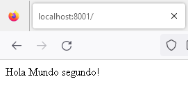

# COMPOSER

## Indice
- [COMPOSER](#composer)
  - [Indice](#indice)
  - [Introducción](#introducción)
  - [Instalar Composer en Windows (nivel global)](#instalar-composer-en-windows-nivel-global)
  - [Instalar composer en un proyecto (nivel local)](#instalar-composer-en-un-proyecto-nivel-local)
  - [Ejecutar composer en nuestro proyecto](#ejecutar-composer-en-nuestro-proyecto)
  - [Añadir composer a un proyecto](#añadir-composer-a-un-proyecto)
  - [Ejemplo de instalar una dependencia de una libreria](#ejemplo-de-instalar-una-dependencia-de-una-libreria)
  - [Restricción de versiones](#restricción-de-versiones)
  - [El archivo composer.lock](#el-archivo-composerlock)
  - [Ejemplo de utilizar las dependencias instaladas](#ejemplo-de-utilizar-las-dependencias-instaladas)
  - [Instalar dependencias de desarrollo](#instalar-dependencias-de-desarrollo)
  - [Actualizar dependencias](#actualizar-dependencias)
  - [Eliminar dependencias](#eliminar-dependencias)
  - [Ejemplo de crear nuestros scripts](#ejemplo-de-crear-nuestros-scripts)
  - [Ejemplo de autocarga de los namespaces con PSR-4](#ejemplo-de-autocarga-de-los-namespaces-con-psr-4)
  - [Ejemplo autocarga de archivos independientes](#ejemplo-autocarga-de-archivos-independientes)
  - [Comandos avanzados](#comandos-avanzados)

## Introducción

[Composer](https://getcomposer.org/) es el gestor de dependencias para PHP. 

[Packagist](https://packagist.org) es el repositorio de paquetes de Composer, ahí se publican los paquetes de PHP.

Gracias a Composer podemos instalar paquetes de terceros en nuestro proyecto.

## Instalar Composer en Windows (nivel global)
Simplemente, [descarga y ejecuta el instalador](https://getcomposer.org/Composer-Setup.exe), una vez lo tengas instalado en tu equipo podrás ejecutar el comando composer y todo estará funcionando.

## Instalar composer en un proyecto (nivel local)
```shell
curl -sS https://getcomposer.org/installer | php
```

## Ejecutar composer en nuestro proyecto
La siguiente sentencia nos muestra la versión de php instalada
```shell
php composer.phar -V
```
## Añadir composer a un proyecto

Si hemos realizado una instalación a nivel global simplemente llamamos a __composer__  si es una instalación local tendriamos que ejecutar __php composer.phar__
```shell
composer init

# Package name (<vendor>/<name>) [cic/01-primer-proyecto]: 
# Description []: Estoy aprendiendo a trabajar con Composer
# Author [ cicIES <carmen.izacastanedo@iesmiguelherrero.com>, n to skip]:
# Minimum Stability []: stable
# Package Type (e.g. library, project, metapackage, composer-plugin) []: project
# License []: 

Define your dependencies.

# Would you like to define your dependencies (require) interactively [yes]? no
# Would you like to define your dev dependencies (require-dev) interactively [yes]? no
# Add PSR-4 autoload mapping? Maps namespace "cic/01-primer-proyecto" to the entered relative path. [src/, n to skip]: no
```
Nos ha creado un archivo __composer.json__ donde figuran las dependencias 
```json
{
    "name": "cic/01-primer-proyecto",
    "description": "Estoy aprendiendo a trabajar con Composer",
    "type": "project",
    "authors": [
        {
            "name": " cicIES",
            "email": "carmen.izacastanedo@iesmiguelherrero.com"
        }
    ],
    "minimum-stability": "stable",
    "require": {}
}
```
y añadimos las dependencias con:
```shell
composer install
```
Creando la siguiente estructura dentro del proyecto:


## Ejemplo de instalar una dependencia de una libreria

Instalamos una librería que genera claves seguras [Password Generator Library](https://github.com/hackzilla/password-generator)

```shell
composer require hackzilla/password-generator
```
En el composer.json incluye la dependencia

```json
{
    "name": "cic/01-primer-proyecto",
    "description": "Estoy aprendiendo a trabajar con Composer",
    "type": "project",
    "authors": [
        {
            "name": " cicIES",
            "email": "carmen.izacastanedo@iesmiguelherrero.com"
        }
    ],
    "minimum-stability": "stable",
    "require": {"hackzilla/password-generator": "^1.6"}
}
```
## Restricción de versiones
```shell
# "vendor/package": "1.3.2", // exactly 1.3.2

# // >, <, >=, <= | specify upper / lower bounds
# "vendor/package": ">=1.3.2", // anything above or equal to 1.3.2
# "vendor/package": "<1.3.2", // anything below 1.3.2

# // * | wildcard
# "vendor/package": "1.3.*", // >=1.3.0 <1.4.0

# // ~ | allows last digit specified to go up
# "vendor/package": "~1.3.2", // >=1.3.2 <1.4.0
# "vendor/package": "~1.3", // >=1.3.0 <2.0.0

# // ^ | doesn't allow breaking changes (major version fixed - following semver)
# "vendor/package": "^1.3.2", // >=1.3.2 <2.0.0
# "vendor/package": "^0.3.2", // >=0.3.2 <0.4.0 // except if major version is 0
```
## El archivo composer.lock
El archivo composer.lock es un archivo generado automáticamente por Composer que contiene información detallada sobre las dependencias específicas de un proyecto, incluyendo las versiones exactas de las dependencias instaladas. Este archivo se utiliza para garantizar que todos los desarrolladores en un equipo estén trabajando con la misma versión de las dependencias.

Cuando se ejecuta el comando "composer install" en un proyecto, Composer lee el archivo composer.json para determinar qué dependencias se deben instalar y en qué versiones. Luego, genera el archivo composer.lock, que contiene información detallada sobre las versiones exactas de las dependencias que se instalaron.

En general se recomienda no modificar el archivo composer.lock manualmente, ya que esto puede causar problemas de compatibilidad y conflictos de versiones. En lugar de eso, se recomienda utilizar el comando __"composer update"__ para actualizar las dependencias de un proyecto, y dejar que Composer se encargue de actualizar el archivo composer.lock automáticamente.

Es una buena práctica subir a nuestros repositorios los archivos composer.json y composer.lock.

En resumen, el archivo composer.lock ayuda a garantizar la estabilidad de un proyecto al especificar las versiones exactas de las dependencias que se han utilizado.

## Ejemplo de utilizar las dependencias instaladas

En el directorio crearemos un index.php 
```php

require_once __DIR__ . '/vendor/autoload.php';

use Hackzilla\PasswordGenerator\Generator\ComputerPasswordGenerator;
// crea el objeto
$generator = new ComputerPasswordGenerator();
// opciones para generar la contraseña
$generator
    ->setOptionValue(ComputerPasswordGenerator::OPTION_UPPER_CASE, true)
    ->setOptionValue(ComputerPasswordGenerator::OPTION_LOWER_CASE, true)
    ->setOptionValue(ComputerPasswordGenerator::OPTION_NUMBERS, true)
    ->setOptionValue(ComputerPasswordGenerator::OPTION_SYMBOLS, true)
    ->setLength(8);

$password = $generator->generatePassword();

echo $password;
```
<div class="page"/>

## Instalar dependencias de desarrollo

Las dependencias de desarrollo son dependencias que sólo necesitamos en entornos de desarrollo, faker, phpunit, etc. Para añadir dependencias de desarrollo, usamos el parámetro `--dev` o `-d`:

```shell
composer require phpunit/phpunit --dev
```

Su uso es el mismo que siempre:
```php

require_once __DIR__ . '/vendor/autoload.php';

use PHPUnit\Framework\TestCase;

class Test extends TestCase
{
    public function test()
    {
        $this->assertTrue(true);
    }
}
```
En entornos de producción, cuando instalemos las dependencias, para evitar las de desarrollo, deberemos hacer lo siguiente:
```shell
composer install --no-dev
```

De esta forma sólo instalaremos dependencias de producción.

## Actualizar dependencias

El comando es __composer update__

```shell
composer update phpunit/phpunit
```

## Eliminar dependencias

El comando es __composer remove__

```shell
composer remove phpunit/phpunit
```

## Ejemplo de crear nuestros scripts

Podemos crear nuestros scripts utilizando composer de la siguiente forma:

Es una etiqueta __scripts__ en el composer.json

Por ejemplo, si queremos por ejemplo que se autoarranque un servidor para probar nuestra aplicación en el directorio `public`, añadimos al fichero __composer.json__ 

```json
"scripts": {
		"start": "php -S localhost:8001 -t public"
	}

```
Crearemos el directorio `public` y pondremos la página web `index.php`, simplemente con un `echo`
```php
echo "Hola Mundo";

```
A continuación, nos vamos a la terminal posicionados en nuestro directorio de trabajo y con el comando __composer start__  pondremos activo el servidor 

```shell
composer start
```
y desde cualquier navegador 


## Ejemplo de autocarga de los namespaces con PSR-4

PSR-4, es una especificación para la autocarga de clases desde la ruta donde se encuentran los archivos.
Por ejemplo, queremos crear un directorio `app`  y mapearlo con el espacio de nombres `App`. Para generar el namespace en el fichero __composer.json__ 

```json
 "autoload": {
        "psr-4": {
            "App\\": "app/"
        }
    }
```
En este caso hemos añadido la sección `autoload` y dentro de ella la sección `psr-4` que nos permite definir los namespaces que queremos utilizar en nuestro proyecto.

A continuación, debemos ejecutar el comando `composer dump-autoload` para que se generen los ficheros necesarios para que composer pueda cargar los namespaces.

```shell
composer dump-autoload
```

Ahora vamos a crear los archivos y directorios necesarios para poder utilizar los namespaces.
Por ejemplo, dentro del directorio `app` creamos un subdirectorio Controllers donde vamos a crear el archivo `HolaMundoController.php` que contenga la una clase `HolaMundoController` con un método `index()`:

```php

namespace App\Controllers;

class HolaMundoController
{
    public function index(): void
    {
        echo "Hola Mundo segundo!";
    }
}
```
Ahora vamos a modificar el archivo `public/index.php` que será el punto de entrada de nuestra aplicación eliminando lo anterior:

```php
// autoload composer
require_once __DIR__ . '/../vendor/autoload.php'; 

use App\Controllers\HolaMundoController; // el namespace

$holaMundoController = new HolaMundoController();

$holaMundoController->index();
```
Una vez tenemos todo preparado, podemos ejecutar el servidor web y comprobar que todo funciona correctamente.
```shell
composer dump-start
```
y desde cualquier navegador 



## Ejemplo autocarga de archivos independientes

Podemos generar namespaces para archivos independientes utilizando composer de la siguiente forma:

Por ejemplo, en el directorio `app` definido en el apartado anterior queremos cargar el archivo `helpers.php`. Modificamos  el fichero __composer.json__ incorporando:

```json
 "autoload": {
        "psr-4": {
            "App\\": "app/"
        },
        "files": [
            "app/helpers.php"
        ]
    }
```    
En este caso hemos añadido la sección `autoload` y dentro de ella la sección `files` que nos permite definir los archivos que queremos utilizar en nuestro proyecto.

Ahora vamos a crear el archivo `helpers.php` en la carpeta `app` y vamos a añadir el siguiente código php:

```php

if ( ! function_exists('holaMundo')) {
    function holaMundo(): string
    {
        return 'Hola Mundo';
    }
}
```
A continuación, debemos ejecutar el comando `composer dump-autoload` para que se generen los ficheros necesarios para que composer pueda cargar los archivos.

```shell
composer dump-autoload
```

Ahora vamos a modificar en el archivo `public/index.php`  incorporando:
```php
echo '<hr>';

echo holaMundo();
```
Una vez tenemos todo preparado, podemos ejecutar el servidor web y comprobar que todo funciona correctamente.

```shell
composer start
```
y desde cualquier navegador 


## Comandos avanzados

Composer ofrece una serie de comandos avanzados que pueden ser útiles en ciertas circunstancias:

* **composer show**: Este comando muestra información sobre las dependencias instaladas en un proyecto, incluyendo sus nombres, versiones y autores.
* **composer validate**: Este comando valida el archivo "composer.json" para asegurar que está bien formado y que las dependencias especificadas son válidas.
* **composer why-not <package>**: Este comando muestra por qué un paquete determinado no puede ser instalado en el proyecto actual, incluyendo cualquier conflicto de versiones o dependencias.
* **composer why <package>**: Este comando muestra qué paquetes hacen que se instale el paquete dado.
* **composer self-update**: Este comando actualiza la instalación de Composer a la última versión disponible.
* **composer outdated**: Este comando muestra las dependencias de un proyecto que están desactualizadas y las versiones más recientes disponibles.
* **composer create-project**: Este comando se utiliza para crear un proyecto a partir de un paquete Composer existente. Por ejemplo, se puede utilizar para instalar un framework como Laravel o Symfony.
* **composer global require <package>**: Este comando instala una dependencia globalmente en el sistema, lo que permite utilizarla en cualquier proyecto sin tener que instalarla manualmente.
* **composer prohibits <package>**: Este comando muestra qué paquetes impiden que se instale el paquete dado.
* **composer home <package>**: Este comando muestra la página del repositorio del paquete dado, si no se ofrece, en un proyecto Laravel por ejemplo se abrirá la página del repositorio de Laravel Framework.
* **composer suggests**: Este comando muestra sugerencias de paquetes para nuestro proyecto.
* **composer exec <binary>**: Este comando ejecuta un script binario del directorio vendor/bin.
* **composer fund**: Este comando muestra cómo ayudar a financiar el mantenimiento de las dependencias utilizadas.
* **composer licenses**: Este comando muestra información acerca del tipo de licencias de las dependencias utilizadas.
* **composer status**: Este comando muestra una lista de paquetes modificados localmente.
