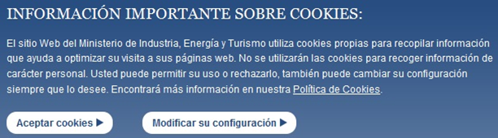

# UT5 DESARROLLO DE APLICACIONES WEB UTILIZANDO CÓDIGO EMBEBIDO

## Índice
- 
	- [Autenticación y control de acceso](#autenticación-y-control-de-acceso)
		- [Mecanismos de autentificación](#mecanismos-de-autentificación)
	- [Cookies](#cookies)
	- [Gestión de sesiones](#gestión-de-sesiones)
  
## Autenticación y control de acceso

Es importante verificar la identidad de los dos extremos de una comunicación.

Se debería utilizar el protocolo HTTPS.

En la mayoría de las aplicaciones web existe un mecanismo de control de acceso que obligue al usuario a identificarse.

### Mecanismos de autentificación

El protocolo HTTP ofrece un método sencillo para autentificar a los usuarios:

* El servidor web debe proveer algún método para **definir los usuarios** que se utilizarán y cómo se pueden autentificar.
* Cuando **un usuario no autentificado intenta acceder** a un recurso restringido, **el servidor web responde con un error** de "Acceso no autorizado" (código 401).
* El **navegador** recibe el error y **abre una ventana** para solicitar al usuario que se autentifique mediante **su nombre y contraseña**.
* La información de autentificación del usuario **se envía al servidor**, que **la verifica**y decide si permite o no el acceso al recurso solicitado. **Esta información se mantiene en el navegador** para utilizarse en posteriores peticiones a ese servidor.
  
En Apache existe la utilidad **htpasswd**
* Fichero con usuarios y contraseñas
* Crearlo en un lugar no accesible por los usuarios del servidor web

Pero ¿cómo le indicamos a Apache qué recursos tienen acceso restringido? Respuesta: Fichero .htaccess

* Además tendrás que asegurarte de que en la configuración de Apache se utiliza **la directiva AllowOverride** para que se aplique correctamente la configuración que figura en el **fichero .htaccess**.

Desde PHP puedes acceder a la información de autentificación HTTP que ha introducido el usuario utilizando el array superglobal **$_SERVER**

* **$_SERVER['PHP_AUTH_USER']** Nombre de usuario que se ha introducido.

* **$_SERVER['PHP_AUTH_PW']** Contraseña introducida.

* **$_SERVER['AUTH_TYPE']** Método HTTP usado para autentificar. Puede ser Basic o Diges.

En PHP puedes usar **la función header** para forzar a que el servidor envíe un error de "Acceso no autorizado" (código 401). De esta forma no es necesario utilizar ficheros .htaccess para indicarle a Apache qué recursos están restringidos.

En su lugar, puedes añadir las siguientes líneas en tus páginas PHP:

```php
if (!isset($_SERVER['PHP_AUTH_USER'])) {
	header('WWW-Authenticate: Basic Realm="Contenido restringido"');
	header('HTTP/1.0 401 Unauthorized');
	echo "Usuario no reconocido!";
	exit();
}
```
Te habrás dado cuenta en el ejercicio anterior que ahora se solicitan credenciales HTTP, pero el servidor no verifica la información. Deberemos ser nosotros los que lo comprobemos.

```php
if ($_SERVER['PHP_AUTH_USER']!='usuario' || $_SERVER['PHP_AUTH_PW']!='contraseña') {
	header('WWW-Authenticate: Basic Realm="Contenido restringido"');
	header('HTTP/1.0 401 Unauthorized');
	echo "Usuario no reconocido!";
	exit();
}
```
Pregunta: 
¿Creéis que esto es correcto? ¿Veis algún inconveniente? ¿Se os ocurre alguna alternativa?

Una solución mejor es utilizar **un almacenamiento externo** para los nombres de usuario y sus contraseñas. Para esto podrías emplear un **fichero de texto**, o mejor aún, **una base de datos**. La información de autentificación podrá estar aislada en su propia base de datos, o compartir espacio de almacenamiento con los datos que utilice tu aplicación web.

Pregunta
¿Cómo almacenaríais la contraseña?

**MD5** es un método para generar un resumen de un texto o un documento, de tal forma que a partir del resumen obtenido no es posible recuperar el texto original, ni hallar otro texto a partir del cual se obtenga el mismo resumen. Se llama hash al resumen obtenido al aplicar una función hash. Una de las funciones hash más extendidas es MD5, que genera 128 bits como resumen (normalmente se representa mediante una cadena de texto de 28 caracteres o mediante 32 dígitos hexadecimales).

En PHP puedes usar la función md5 para calcular el hash MD5 de una cadena de texto

```php
$str = 'contraseña';
if (md5($str) == '4c882dcb24bcb1bc225391a602feca7c') {
    echo "Contraseña correcta";
}
```
:computer: Hoja05_Sesiones_01

## Cookies



Pero, ¿qué es una **cookie**?

En PHP, las cookies son un mecanismo por el cual se almacenan datos en el navegador remoto para identificar a los usuarios que vuelven al sitio web.

Es importante tener en cuenta que las cookies se almacenan en el navegador del usuario y se pueden leer y modificar fácilmente. Por lo tanto, no se deben almacenar datos sensibles en las cookies.

Una cookie es un fichero de texto que se guarda en el entorno del usuario del navegador.

Su uso más típico es el almacenamiento de las preferencias del usuario (por ejemplo, el idioma en que se deben mostrar las páginas), para que no tenga que volver a indicarlas la próxima vez que visite el sitio.

El objetivo esencial de una cookie es identificar nuestro usuario al almacenar y alojar el historial de actividad de dicho sitio web, esto permite que el sitio web identifique los usos habituales en esa página y en base a ello ofrecer las mejores alternativas de contenido al usuario.

Recordemos que a nivel web existen algunos tipos de cookie como son:

* **Zombie cookies** las cuales tienen la capacidad de regenerarse una vez han sido borradas del sistema ya que se alojan en el sistema mas no directamente en el navegador.

* **Secure cookies** las cuales almacenan la información usando métodos de cifrado con el fin de impedir que los datos guardados estén abiertos a ataques maliciosos y este tipo de cookies solo es usada en conexiones HTTPS.

* **Session cookies** las cuales como su nombre lo dice, son las cookies de cada sesión iniciada en el navegador y estas serán borradas al cerrar el navegador.

* **Persistent cookies** las cuales son las más frecuentes y tienen como misión rastrear todos los proceso del usuario al almacenar información sobre todo lo que hace en el sitio web tomando como base un período de tiempo determinado, estas cookies persistentes son borradas cuando se eliminan los datos del navegador usado.

En PHP, para almacenar una cookie en el navegador del usuario, podemos utilizar la función **setcookie**

```php
setcookie("nombreUsuario", $_SERVER['PHP_AUTH_USER'], time()+3600);
```
Para crear una cookie, se debe llamar a la función `setcookie()` y pasarle el nombre de la cookie, el valor de la cookie y la fecha de caducidad (opcional). El tiempo por defecto se indica en segundos.

Para leer una cookie, se puede acceder a ella a través de la variable superglobal `$_COOKIE`.
El proceso de recuperación de la información que almacena una cookie es muy simple. Cuando accedes a un sitio web, el navegador le envía de forma automática todo el contenido de las cookies que almacene relativas a ese sitio en concreto. 
Desde PHP puedes acceder a esta información por medio del array **$_COOKIE**

```php
echo $_COOKIE("nombreUsuario");
```
Para eliminar una cookie en PHP, se puede llamar a la función `setcookie()` y establecer la fecha de caducidad en un momento anterior al actual.

Por ejemplo, para eliminar la cookie `nombreUsuario`, se puede usar el siguiente código:

```php
setcookie("nombreUsuario", "", time() - 3600);
```

Este código establece la fecha de caducidad de la cookie en una hora antes de la hora actual, lo que hace que el navegador elimine la cookie.También es posible establecer la fecha de caducidad en un momento anterior al actual para eliminar la cookie inmediatamente.

Para comprobar si una cookie existe en PHP, se puede acceder a ella a través de la variable superglobal `$_COOKIE` . Si la cookie existe, su valor se puede leer directamente de `$_COOKIE`. Por ejemplo, para verificar si la cookie `nombreUsuario` existe, se puede usar el siguiente código:

```php
if (isset($_COOKIE["nombreUsuario"])) {
    echo "La cookie 'nombre usuario' existe y su valor es: " . $_COOKIE["nombreUsuario"];
} else {
    echo "La cookie 'nombre usuario' no existe.";
}
```

Este código verifica si la cookie `nombreUsuario` existe y, si es así, muestra su valor. Si la cookie no existe, se muestra un mensaje indicando que no existe.

Para establecer una __cookie segura__ en PHP, se puede utilizar el parámetro `secure` de la función `setcookie()` . Este parámetro debe establecerse en `true` para indicar que la cookie solo debe transmitirse a través de una conexión segura HTTPS. Por ejemplo, para crear una cookie llamada `nombreUsuario` con el valor `Juan` que caduca en 24 horas y que solo se transmite a través de HTTPS, se puede usar el siguiente código:

```php
setcookie("nombreUsuario", "Juan", time() + 86400, "/", "", true, true);
```

Este código establece la cookie `nombreUsuario` con el valor `Juan`, que caduca en 24 horas, tiene una ruta de `/`, no tiene un dominio especificado, y solo se transmite a través de HTTPS.

Para establecer una __cookie HTTPOnly__ en PHP, se puede utilizar el parámetro `httponly` de la función `setcookie()` . Este parámetro debe establecerse en `true` para indicar que la cookie solo debe ser accesible a través del protocolo HTTP y no debe ser accesible a través de JavaScript. Por ejemplo, para crear una cookie llamada `nombreUsuario` con el valor `Juan` que caduca en 24 horas y que solo es accesible a través del protocolo HTTP, se puede usar el siguiente código:

```php
setcookie("nombreUsuario", "Juan", time() + 86400, "/", "", false, true);
```

Este código establece la cookie `nombreUsuario` con el valor `Juan`, que caduca en 24 horas, tiene una ruta de `/`, no tiene un dominio especificado, y solo es accesible a través del protocolo HTTP.


:computer: Hoja05_Sesiones_02

## Gestión de sesiones

El término sesión hace referencia al conjunto de información relativa a un usuario concreto.
Ejemplos:
* Nombre del usuario
* Artículos de la lista de la compra de una tienda online
  
Cada usuario distinto de un sitio web tiene su propia información de sesión.

Para distinguir una sesión de otra se usan **los identificadores de sesión (SID)**. 

Un **SID** es un atributo que se asigna a cada uno de los visitantes de un sitio web y lo identifica.

Las sesiones en PHP son una forma de almacenar datos para usuarios de manera individual usando un ID de sesión único __(SID)__. Las sesiones se pueden usar para hacer persistente la información de estado entre peticiones de páginas. Para usar las sesiones, se debe iniciar el manejo de la sesión al principio del código PHP, usando el array `$_SESSION`. También se debe cerrar la sesión cuando no se necesite, y tener en cuenta la seguridad de las sesiones.

Cuando una sesión se inicia, PHP recuperará una sesión existente usando el ID pasado (normalmente desde una cookie de sesión) o, si no se pasa una sesión, se creará una sesión nueva. PHP rellenará la variable superglobal `$_SESSION` con cualesquiera datos de la sesión iniciada. Las variables de sesión son el mecanismo más práctico para conseguir almacenar datos que se recordarán durante toda la sesión del usuario, es decir, durante todas las páginas que visita dentro de un sitio web.

En PHP el manejo de sesiones está automatizado en gran medida. 

* Cuando un usuario visita un sitio web, no es necesario programar un procedimiento para ver si existe un SID previo y cargar los datos asociados con el mismo. Tampoco tienes que utilizar la función setcookie si quieres almacenar los SID en cookies, o ir pasando el SID entre las páginas web de tu sitio si te decides por propagarlo. Todo esto PHP lo hace automáticamente.
* Por defecto, PHP incluye soporte de sesiones incorporado. 

Sin embargo, antes de utilizar sesiones en tu sitio web, debes configurar correctamente PHP utilizando las siguientes directivas en el **fichero php.ini** según corresponda.

| Directiva | Significado |
| ---------------- | -------------------------------------- |
| __session.use_cookies__  |Indica si se deben usar cookies (1) o propagación en la URL (0) para almacenar el SID |
| __session.use_only_cookies__  |Se debe activar (1) cuando utilizas cookies para almacenar los SID, y además no quieres que se reconozcan los SID que se puedan pasar como parte de la URL (este método se puede usar para usurpar el identificador de otro usuario) |
| __session.save_handler__  |Se utiliza para indicar a PHP cómo debe almacenar los datos de la sesión del usuario. Existen cuatro opciones: en ficheros (files), en memoria (mm), en una base de datos SQLite (sqlite) o utilizando para ello funciones que debe definir el programador (user). El valor por defecto (files) funcionará sin problemas en la mayoría de los casos |
| __session.name__  |Determina el nombre de la cookie que se utilizará para guardar el SID. Su valor por defecto es PHPSESSID |
| __session.auto_start__  |Su valor por defecto es 0, y en este caso deberás usar **la función session_start** para gestionar el inicio de las sesiones. Si usas sesiones en el sitio web, puede ser buena idea cambiar su valor a 1 para que PHP active de forma automática el manejo de sesiones |
| __session.cookie_lifetime__  |Si utilizas la URL para propagar el SID, éste se perderá cuando cierres tu navegador. Sin embargo, si utilizas cookies, el SID se mantendrá mientras no se destruya la cookie. En su valor por defecto (0), las cookies se destruyen cuando se cierra el navegador. Si quieres que se mantenga el SID durante más tiempo, debes indicar en esta directiva ese tiempo en segundos |
| __session.gc_maxlifetime__  |Indica el tiempo en segundos que se debe mantener activa la sesión, aunque no haya ninguna actividad por parte del usuario. Su valor por defecto es 1440. Es decir, pasados 24 minutos desde la última actividad por parte del usuario, se cierra su sesión automáticamente |

El inicio de una sesión puede tener lugar de dos formas: 

* Si has activado la directiva **session.auto_start** en la configuración de PHP, la sesión comenzará automáticamente en cuanto un usuario se conecte a tu sitio web.
* Si no se utiliza el inicio automático de sesiones, habrá que ejecutar la función **session_start** para indicar a PHP que inicie una nueva sesión o reanude la anterior. Está función devuelve false en caso de no poder iniciar o restaurar la sesión.
* Mientras la sesión permanece abierta, puedes utilizar la variable superglobal **$_SESSION** para añadir información a la sesión del usuario, o para acceder a la información almacenada en la sesión.

Para eliminar la información almacenada en la sesión:

* __session_unset__. Elimina las variables almacenadas en la sesión actual, pero no elimina la información de la sesión del dispositivo de almacenamiento usado. Sería similar a hacer $_SESSION = array();
* __session_destroy__. Elimina completamente la información de la sesión del dispositivo de almacenamiento.


Para asegurar las sesiones en PHP, hay varias prácticas recomendadas que se pueden seguir . Algunas de ellas son:

1. Usar HTTPS: Utilizar una conexión segura HTTPS es fundamental para reforzar la seguridad de tus aplicaciones, incluyendo las sesiones. De esta forma, incluso si alguien logra capturar el tráfico, le será virtualmente imposible leer el contenido.

2. Regenerar el ID de sesión: Después de un inicio de sesión exitoso o un cambio de privilegios, regenerar el ID de sesión. Esto ayuda a prevenir ataques de secuestro de sesión.

3. Usar `session_set_cookie_params`: Esta función permite establecer parámetros adicionales para las cookies de sesión, como la duración de la cookie y la ruta de acceso.

4. Limpieza de sesiones inactivas: Es importante limpiar las sesiones inactivas para evitar que se acumulen y consuman recursos del servidor.

5. Validar y escapar los datos de sesión: Es importante validar y escapar los datos de sesión para prevenir ataques de inyección de código.

6. Implementar autenticación de dos factores (2FA): La autenticación de dos factores puede ayudar a reforzar la seguridad de las sesiones.

7. Mantenerse actualizado: Es importante mantenerse actualizado con las últimas versiones de PHP y sus extensiones para asegurarse de que se están utilizando las últimas características de seguridad.


:computer: Hoja05_Sesiones_03


