# UT7 PROGRAMACIÓN DE SERVICIOS WEB
## índice
- [UT7 PROGRAMACIÓN DE SERVICIOS WEB](#ut7-programación-de-servicios-web)
  - [índice](#índice)
  - [Introducción](#introducción)
  - [Servicios Web](#servicios-web)
  - [Mecanismos y protocolos implicados](#mecanismos-y-protocolos-implicados)
  - [SOAP](#soap)
  - [WSDL](#wsdl)
  - [API REST](#api-rest)
    - [Que és](#que-és)
    - [Características](#características)
      - [Ayudas a la mejora del código](#ayudas-a-la-mejora-del-código)
      - [Definir el proyecto](#definir-el-proyecto)
      - [Instalar, configurar las rutas de la aplicación](#instalar-configurar-las-rutas-de-la-aplicación)
      - [Crear el primer controlador utilizando router](#crear-el-primer-controlador-utilizando-router)
      - [Preparar las respuestas JSON de la API REST](#preparar-las-respuestas-json-de-la-api-rest)
    - [POSTMAN](#postman)
      - [Configurar un entorno](#configurar-un-entorno)
      - [Crear un ejemplo de conexión a base de datos, crear una entidad con operaciones CRUD y respuestas JSON](#crear-un-ejemplo-de-conexión-a-base-de-datos-crear-una-entidad-con-operaciones-crud-y-respuestas-json)
    - [Añadir un sistema de validación propio a la API REST](#añadir-un-sistema-de-validación-propio-a-la-api-rest)
      - [Crear un sistema para validar las reglas](#crear-un-sistema-para-validar-las-reglas)
        - [Crear las reglas de validación](#crear-las-reglas-de-validación)
      - [Crear una sistema para validar las peticiones](#crear-una-sistema-para-validar-las-peticiones)
        - [Crear la validación de un modelo](#crear-la-validación-de-un-modelo)
      - [Aplicar el modelo de validación a un proceso](#aplicar-el-modelo-de-validación-a-un-proceso)
  - [Servicios web REST](#servicios-web-rest)
    - [Cliente](#cliente)
    - [Servidor Laravel](#servidor-laravel)

## Introducción
En ocasiones, las aplicaciones que desarrolles necesitarán compartir información con otras aplicaciones o puede ser que, una vez que esté finalizada y funcionando, quieras programar una nueva aplicación (y no necesariamente una aplicación web)

Para compartir la información que gestiona tu aplicación, normalmente es suficiente con dar acceso a la base de datos en que se almacena. Pero esta generalmente no es una buena idea. Cuantas más aplicaciones utilicen los mismos datos, más posibilidades hay de que se generen errores en los mismos. Además, existen otros inconvenientes:

* Si ya tienes una aplicación funcionando, ya has programado la lógica de negocio correspondiente, y ésta no se podrá aprovechar en otras aplicaciones si utilizan directamente la información almacenada en la base de datos.

* Si quieres poner la base de datos a disposición de terceros, éstos necesitarán conocer su estructura Y al dar acceso directo a los datos, será complicado mantener el control sobre las modificaciones que se produzcan en los mismos.

<div class="page"/>

## Servicios Web
Para facilitar esta tarea existen los servicios web.

__Un servicio web__ es un método que permite que dos equipos intercambien información a través de una red informática.
Al utilizar servicios web, el servidor puede ofrecer __un punto de acceso__ a la información que quiere compartir. De esta forma __controla y facilita el acceso__ a la misma por parte de otras aplicaciones.

__Los clientes del servicio__, por su parte, no necesitan conocer la estructura interna de almacenamiento. En lugar de tener que programar un mecanismo para localizar la información, tienen un __punto de acceso directo__ a la que les interesa.

## Mecanismos y protocolos implicados
¿Qué protocolos de red conocéis? FTP, HTTP, SMTP, POP 3 TELNET, etc.

En todos estos protocolos se definen un servidor y un cliente pero no han sido diseñados para transportar peticiones de información genéricas entre aplicaciones.

Sin embargo, ya desde hace tiempo existen otras soluciones para este tipo de problemas. Una de las más populares es __RPC__

El protocolo RPC se creó para permitir a un sistema acceder de forma remota a funciones o procedimientos que se encuentren en otro sistema El cliente se conecta con el servidor, y le indica qué función debe ejecutar. El servidor la ejecuta y le devuelve el resultado obtenido. Así, por ejemplo, podemos crear en el servidor RPC una función que reciba un código de producto y devuelva su PVP.

Los servicios web se crearon para permitir el intercambio de información al igual que RPC, pero sobre la base del protocolo HTTP (de ahí el término web).

En lugar de definir su propio protocolo para transportar las peticiones de información, utilizan HTTP para este fin. La respuesta obtenida no será una página web, sino la información que se solicitó. De esta forma pueden funcionar sobre cualquier servidor web y, lo que es aún más importante, utilizando el puerto 80 reservado para este protocolo.

Por tanto, cualquier ordenador que pueda consultar una página web, podrá también solicitar información de un servicio web.

Pero...

* ¿Cómo se transmite la información? Es decir, ¿cómo hace el cliente para indicar que quiere conocer el PVP del artículo con código X?, y también, ¿cómo envía el servidor la respuesta obtenida? __PROTOCOLO SOAP__

* ¿Cómo se publican las funciones a las que se puede acceder en un servidor determinado?
Es decir, el cliente puede saber que la función del servidor que tiene que utilizar se llama getPVPArticulo y que debe recibir como parámetro el código del artículo. Pero si no lo sabe, sería útil que hubiera un mecanismo donde pudiera consultar las funciones que existen en el servidor y cómo se utiliza cada una. __WSDL__

## SOAP
SOAP es un protocolo que indica cómo deben ser los mensajes que se intercambien el servidor y el cliente, cómo deben procesarse éstos, y cómo se relacionan con el protocolo que se utiliza para transportarlos de un extremo a otro de la comunicación (en el caso de los servicios web, este protocolo será HTTP)

Aunque nosotros vamos a utilizar HTTP para transmitir la información, SOAP no requiere el uso de un protocolo concreto para transmitir la información.

SOAP se limita a definir las reglas que rigen los mensajes que se deben intercambiar el cliente y el servidor. Cómo se envíen esos mensajes no es relevante desde el punto de vista de SOAP. En lugar de utilizar HTTP para transmitirlos, se podrían utilizar, por ejemplo, correos electrónicos (claro que en este caso ya no sería un servicio web).


Actualmente en desuso.

## WSDL

Para que un servicio web sea accesible a aplicaciones desarrolladas por otros programadores, habrá que indicarles cómo usarlo, es decir, crear un documento WSDL que describa el servicio.

WSDL es un lenguaje basado en XML que utiliza unas reglas determinadas para generar el documento de descripción de un servicio web. Una vez generado, ese documento se suele poner a disposición de los posibles usuarios del servicio(normalmente se accede al documento WSDL añadiendo?wsdl a la URL del servicio).

El espacio de nombres de un documento WSDL es http://schemas.xmlsoap.org/wsdl, aunque en un documento WSDL se suelen utilizar también otros espacios de nombres.

Actualmente en desuso.

## API REST
Una API REST, o API RESTful, es una interfaz de programación de aplicaciones (API o API web) que se ajusta a los límites de la arquitectura REST y permite la interacción con los servicios web de RESTful. El informático Roy Fielding es el creador de la transferencia de estado representacional (REST).

### Que és
Una API REST (Representational State Transfer) es un estilo de arquitectura de software que se utiliza para diseñar sistemas de comunicación en red, especialmente en el contexto de aplicaciones web. Es un enfoque que se basa en el protocolo HTTP y se adhiere a ciertos principios y restricciones que facilitan la interacción entre sistemas de software de una manera simple y eficiente.

Las API son conjuntos de definiciones y protocolos que se utilizan para diseñar e integrar el software de las aplicaciones. Suele considerarse como el contrato entre el proveedor de información y el usuario, donde se establece el contenido que se necesita por parte del consumidor (la llamada) y el que requiere el productor (la respuesta).

Por ejemplo, el diseño de una API de servicio meteorológico podría requerir que el usuario escribiera un código postal y que el productor diera una respuesta en dos partes: la primera sería la temperatura máxima y la segunda, la mínima.

En otras palabras, las API le permiten interactuar con un ordenador o un sistema para obtener datos o ejecutar una función, de manera que el sistema comprenda la solicitud y la cumpla. 

Imagínelas como si fueran los mediadores entre los usuarios o clientes y los recursos o servicios web que quieren obtener. Con ellas, las empresas pueden compartir recursos e información mientras conservan la seguridad, el control y la autenticación, lo cual les permite determinar el contenido al que puede acceder cada usuario. 

Otra ventaja de las API es que el usuario no necesita saber cómo se recibe el recurso ni de dónde proviene.

### Características

Algunas de las características clave de una API REST incluyen:

* __Recursos__: En una API REST, los datos se modelan como recursos, que son objetos o conceptos que pueden ser identificados mediante una URL única. Por ejemplo, en una API de redes sociales, los usuarios, publicaciones y comentarios serían considerados recursos.

* __Operaciones CRUD__: Las operaciones en los recursos se realizan a través de los métodos HTTP estándar, como GET (para recuperar datos), POST (para crear nuevos recursos), PUT (para actualizar recursos) y DELETE (para eliminar recursos). Estas operaciones reflejan las operaciones CRUD (Crear, Leer, Actualizar, Eliminar) en una base de datos.

* __Sin estado__: Cada solicitud a una API REST debe contener toda la información necesaria para entenderla. El servidor no mantiene información sobre el estado de la sesión del cliente entre solicitudes. Esto hace que las aplicaciones sean más escalables y fáciles de mantener.

* __Interfaz uniforme__: Una API REST sigue un conjunto uniforme de reglas y convenciones para la estructura de las URLs, los métodos HTTP y la representación de datos (generalmente en formatos como JSON o XML). Esto hace que las APIs sean predecibles y fáciles de usar.

* __Cliente-Servidor__: La arquitectura REST separa claramente el cliente (quien realiza solicitudes) del servidor (quien proporciona los recursos). Esto permite que ambos evolucionen independientemente.

* __Capas__: Puede haber varias capas intermedias, como servidores proxy o sistemas de almacenamiento en caché, entre el cliente y el servidor, sin afectar la comunicación entre ellos.

Las APIs REST son ampliamente utilizadas en el desarrollo de aplicaciones web y móviles debido a su simplicidad y escalabilidad. Permiten a los desarrolladores acceder y manipular recursos a través de solicitudes HTTP estándar, lo que facilita la integración de servicios y la construcción de aplicaciones distribuidas.

#### Ayudas a la mejora del código

__PHPStan__ es una herramienta de análisis estático para el lenguaje de programación PHP. Su principal objetivo es ayudar a los desarrolladores de PHP a encontrar errores en el código fuente antes de que se ejecuten las aplicaciones. PHPStan se basa en la teoría de tipos estáticos y utiliza técnicas avanzadas de análisis estático para detectar problemas en el código PHP sin necesidad de ejecutarlo.

Algunas de las características y funcionalidades de PHPStan incluyen:

* __Detección de errores estáticos__: PHPStan examina el código PHP en busca de errores y problemas potenciales, como tipos incorrectos de variables, llamadas a métodos inexistentes, uso de variables no declaradas y otras situaciones problemáticas.

* __Análisis de tipos__: PHPStan realiza un análisis de tipos estáticos en el código, lo que significa que puede inferir el tipo de datos de las variables y detectar inconsistencias o incompatibilidades de tipos.

* __Niveles de análisis__: PHPStan ofrece varios niveles de análisis, desde el nivel 0 (más permisivo) hasta el nivel 8 (más estricto). Los niveles más altos imponen restricciones más estrictas en el código, lo que permite una detección de errores más precisa.

* __Extensibilidad__: Puedes extender PHPStan con reglas personalizadas para adaptar la herramienta a las necesidades específicas de tu proyecto o equipo de desarrollo.

* __Integración con herramientas de construcción__: PHPStan se puede integrar con sistemas de construcción y automatización, como Composer y herramientas de CI/CD (Integración Continua/Entrega Continua), lo que facilita su incorporación en el flujo de trabajo de desarrollo.

PHPStan es ampliamente utilizado en la comunidad de desarrollo de PHP para mejorar la calidad del código y prevenir errores antes de que lleguen a la producción. Ayuda a los equipos de desarrollo a escribir código más robusto, legible y mantenible, lo que a su vez reduce la cantidad de errores que se manifiestan en tiempo de ejecución y mejora la eficiencia en el desarrollo de aplicaciones PHP.

__PHP CS Fixer__ (PHP Coding Standards Fixer) es una herramienta de línea de comandos utilizada en el entorno de desarrollo de PHP para ayudar a mantener y aplicar estándares de codificación consistentes en proyectos PHP. Su principal función es formatear y corregir automáticamente el código fuente de acuerdo con las convenciones de codificación establecidas, lo que facilita la colaboración en equipos de desarrollo y asegura que el código cumpla con las mejores prácticas de codificación.

Las características y funcionalidades clave de PHP CS Fixer incluyen:

* __detección y corrección de problemas de estilo de codificación__: La herramienta puede identificar y corregir automáticamente problemas de estilo en el código, como indentación incorrecta, uso inconsistente de espacios o tabulaciones, y otros problemas relacionados con la presentación del código.

* __Adherencia a estándares de codificación__: PHP CS Fixer es altamente configurable y se puede personalizar para seguir una variedad de estándares de codificación, como PSR-1, PSR-2 y PSR-12, que son estándares ampliamente aceptados en la comunidad de desarrollo de PHP.

* __Compatibilidad con proyectos existentes__: Puede utilizarse en proyectos PHP ya existentes para aplicar y mantener consistentes las reglas de codificación en todo el código fuente.

* __Integración con herramientas de construcción y flujo de trabajo__: PHP CS Fixer se puede integrar fácilmente en herramientas de construcción como Composer, así como en flujos de trabajo de CI/CD (Integración Continua/Entrega Continua), lo que permite automatizar la corrección de estilo y la verificación de estándares de codificación en el proceso de desarrollo.

* __Configuración personalizada__: La herramienta permite personalizar las reglas de codificación, lo que significa que puedes adaptarla a las necesidades específicas de tu proyecto o equipo.

En resumen, PHP CS Fixer es una herramienta esencial para el desarrollo de PHP, ya que ayuda a garantizar la coherencia en el código, mejora la legibilidad y facilita el mantenimiento del mismo al mantener estándares de codificación consistentes en todo el proyecto.

Estas dos herramientas las instalaremos con Composer, pero sólo en el entorno de desarrollo:

Más información sobre la herramienta [PHPStan](https://phpstan.org/) y de la herramienta [PHP-CS-Fixer](https://github.com/PHP-CS-Fixer/PHP-CS-Fixer)

```shell
composer require --dev phpstan/phpstan

composer require --dev friendsofphp/php-cs-fixer
```


Una configuración de estas herramientas dentro de un proyecto puede ser:
*  `phpstan.neon`

```php
parameters:
    level: 6
    paths:
        - src
        - routes

```

* `.php-cs-fixer.php`

```php
use PhpCsFixer\{
    Config, Finder,
};

$finder = Finder::create()
    ->in(__DIR__ . '/src')
    ->in(__DIR__ . '/routes')
    ->ignoreDotFiles(true)
    ->exclude('vendor');

return (new Config)->setRules([
    '@PSR12' => true,
    '@PSR12:risky' => true,
    '@PHP82Migration' => true,
    '@PHP80Migration:risky' => true,
    'array_syntax' => ['syntax' => 'short'],
    'binary_operator_spaces' => ['operators' => ['=>' => 'align_single_space_minimal']],
    'blank_line_after_opening_tag' => true,
    'blank_line_before_statement' => ['statements' => ['break', 'continue', 'declare', 'return', 'throw', 'try']],
    'braces' => ['allow_single_line_closure' => true, 'position_after_anonymous_constructs' => 'same', 'position_after_control_structures' => 'same', 'position_after_functions_and_oop_constructs' => 'next'],
    'cast_spaces' => ['space' => 'single'],
    'class_attributes_separation' => ['elements' => ['method' => 'one']],
    'class_definition' => ['single_line' => true],
    'concat_space' => ['spacing' => 'one'],
    'declare_equal_normalize' => ['space' => 'single'],
    'function_typehint_space' => true,
    'include' => true,
    'increment_style' => ['style' => 'post'],
    'linebreak_after_opening_tag' => true,
    'lowercase_cast' => true,
    'lowercase_static_reference' => true,
    'magic_constant_casing' => true,
    'magic_method_casing' => true,
    'method_argument_space' => ['on_multiline' => 'ensure_fully_multiline'],
    'native_function_casing' => true,
    'native_function_type_declaration_casing' => true,
    'new_with_braces' => true,
    'no_alternative_syntax' => true,
    'no_blank_lines_after_class_opening' => true,
    'no_blank_lines_after_phpdoc' => true,
    'no_empty_phpdoc' => true,
    'no_empty_statement' => true,
    'no_extra_blank_lines' => ['tokens' => ['break', 'continue', 'curly_brace_block', 'extra', 'parenthesis_brace_block', 'return', 'square_brace_block', 'switch', 'throw', 'use', 'use_trait']],
    'no_leading_import_slash' => true,
])
    ->setRiskyAllowed(true)
    ->setFinder($finder);
``` 
Para ejecutar las herramientas

```shell
## Ejecuta PHPStan
	./vendor/bin/phpstan analyse -c phpstan.neon

## Aplica PHP CS Fixer a nuestro proyecto
	./vendor/bin/php-cs-fixer fix

``` 

La librería externa [phpdotenv](https://github.com/vlucas/phpdotenv) que nos permite definir un fichero `.env` para tener todas las variables de entorno definidas.


#### Definir el proyecto

Crear el directorio del proyecto con los siguientes subdirectorios `public` donde irá nuestra página web de inicio,  `routes` donde figura el archivo que contendrá los puntos de acceso de la aplicación y `src` donde almacenaremos el resto de nuestros programas php.
Instalar composer en nuestro proyecto y que solo instale librerias externas estables

```shell
composer init
```
Modificamos el fichero `composer.json ` para deninir el espacio de nombres por ejemplo, `App` para nuestro directorio `src`
```php
 "autoload": {
        "psr-4": {
            "App\\": "src/"
        }
    },
```
Que composer tenga en cuenta el cambio
```shell
composer dump-autoload
```

Realizar las instalaciones de las librerias de ayuda y crear los ficheros de configuración
```shell
composer require --dev phpstan/phpstan

composer require --dev friendsofphp/php-cs-fixer

composer require vlucas/phpdotenv

```
Comprobar que podemos ejecutar las herramientas
```shell
./vendor/bin/phpstan analyse -c phpstan.neon
./vendor/bin/php-cs-fixer fix

```
La  estructura de carpetas para nuestro proyecto es:
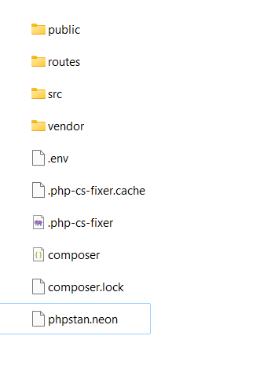

#### Instalar, configurar las rutas de la aplicación

En PHP, una "ruta" generalmente se refiere a una dirección URL o un camino dentro de una aplicación web que se utiliza para acceder a un recurso o una página específica. Las rutas son una parte fundamental de muchas aplicaciones web, ya que permiten a los usuarios navegar por diferentes secciones del sitio web y acceder a funcionalidades específicas.

Las rutas en PHP suelen estar asociadas a acciones o controladores que procesan las solicitudes del usuario y generan respuestas correspondientes. Estas rutas pueden ser definidas en el código de la aplicación utilizando un enrutador (router) o un sistema de gestión de rutas. Un enrutador es una parte del marco de trabajo (framework) o se implementa manualmente para mapear las URL a las funciones o métodos del controlador que deben ejecutarse.

Para configurar las rutas de la aplicación utilizamos la librería externa [simple-php-router](https://github.com/skipperbent/simple-php-router) que nos proporciona el enrutador
```shell
composer require pecee/simple-router
```
Ejemplo de configuración

Así que en el directorio de routes definimos el fichero **api.php** por ejemplo, con el siguiente contenido
```php
/*directiva PHP modo estricto de tipos, comprobaciones más rigurosas en cuento a tipo de datos 
que utilizan en las funciones y métodos, lo que ayuda a reducir errores con el tipo de datos
y mejorar la calidad y seguridad del código
*/
declare(strict_types=1);
use Pecee\SimpleRouter\SimpleRouter as Router;
//definimos la primera ruta por get en el raiz que muestra hola mundo
Router::get('/',function(){
    return "Hola mundo";
});
//definimos por ejemplo nuestra primera entrada en la api
Router::get('/api',function(){
    return "Esta es la entrada a nuestra API REST";
});
```

y creamos nuestro fichero de arranque dentro del directorio público creado, anteriormente este archivo se configuraba en la raiz del proyecto ahora se recomienda crear un directorio `public` donde crear el archivo `index.php` por seguridad en los servidores.
Al crear `index.php` tenemos que tener cuidado en los direccionamientos para cargar todas las librerias externas.
Un ejemplo del fichero **index.php**
```php

declare(strict_types=1);
use Pecee\SimpleRouter\SimpleRouter as Router;
//cargamos las librerias y el fichero de rutas
require __DIR__.'/../vendor/autoload.php';
require __DIR__.'/../routes/api.php';
// cargamos el fichero .env con la configuración
$dotenv = Dotenv\Dotenv::createImmutable(__DIR__ . '/../');
$dotenv->load();
// cargamos el router
Router::start();

```

Una vez creado para probar que accedemos a la ruta creada. Arrancamos un terminal con el punto de acceso al directorio `public` definido
```shell
php -S localhost:8001 -t=public
```

En el navegador podemos comprobar:

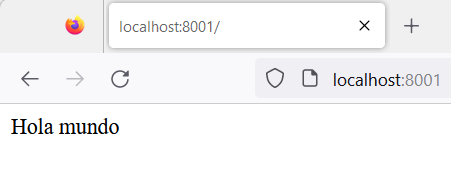

y si acedemos a la api

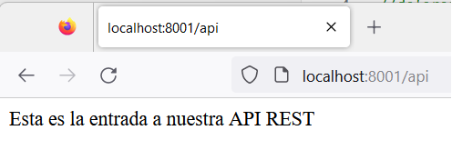

#### Crear el primer controlador utilizando router
En el contexto de PHP y el patrón de diseño de software Modelo-Vista-Controlador (MVC), un "controller" (controlador) es una parte fundamental de la arquitectura que se encarga de manejar las solicitudes del usuario, procesarlas y controlar la lógica de la aplicación. Su principal objetivo es actuar como un intermediario entre la vista (interfaz de usuario) y el modelo (los datos y la lógica de negocio).

Para introducir los controladores en el ejemplo anterior, realizamos los siguientes pasos:

En el fichero __index.php__ añadimos:
```shell
Router::setDefaultNamespace('\App\Controllers\Api');
```
Con esto estamos diciendo que dentro de `src` vamos a tener otro subdirectorio `Controllers\Api` que tenemos que crear y a partir de aquí creamos los controladores en este caso **ApiController.php** Crear un controlador que este mapeado por una ruta. 

Para configurar este controlador tenemos que utilizar una serie de funciones que nos provee la libreria externa Router y es una recomendación que nosotros vamos a utilizar [Funciones Helper](https://github.com/skipperbent/simple-php-router#helper-functions).Creamos un fichero __helpers.php__ que ubicamos dentro de la carpeta `src`, también tenemos que modificar `composer.json` para que realice la carga de este fichero

Un ejemplo de fichero __helpers.php__
```php
declare(strict_types = 1);

use Pecee\SimpleRouter\SimpleRouter as Router;
use Pecee\Http\Url;
use Pecee\Http\Response;
use Pecee\Http\Request;

/**
 * Get url for a route by using either name/alias, class or method name.
 *
 * The name parameter supports the following values:
 * - Route name
 * - Controller/resource name (with or without method)
 * - Controller class name
 *
 * When searching for controller/resource by name, you can use this syntax "route.name@method".
 * You can also use the same syntax when searching for a specific controller-class "MyController@home".
 * If no arguments is specified, it will return the url for the current loaded route.
 *
 * @param string|null $name
 * @param string|array|null $parameters
 * @param array|null $getParams
 * @return \Pecee\Http\Url
 * @throws \InvalidArgumentException
 */
function url(?string $name = null, $parameters = null, ?array $getParams = null): Url
{
    return Router::getUrl($name, $parameters, $getParams);
}

/**
 * @return \Pecee\Http\Response
 */
//retorna el respuesta del router que nos sirve para mostrar las respuestas en formato Json
function response(): Response
{
    return Router::response();
}

/**
 * @return \Pecee\Http\Request
 */
//nos sirve para recuperar los datos que nos van a enviar desde el exterior
function request(): Request
{
    return Router::request();
}

/**
 * Get input class
 * @param string|null $index Parameter index name
 * @param string|mixed|null $defaultValue Default return value
 * @param array ...$methods Default methods
 * @return \Pecee\Http\Input\InputHandler|array|string|null
 */
// recuperar el input que nos envian desde fuera
function input($index = null, $defaultValue = null, ...$methods)
{
    if ($index !== null) {
        return request()->getInputHandler()->value($index, $defaultValue, ...$methods);
    }

    return request()->getInputHandler();
}

/**
 * @param string $url
 * @param int|null $code
 */
function redirect(string $url, ?int $code = null): void
{
    if ($code !== null) {
        response()->httpCode($code);
    }

    response()->redirect($url);
}

/**
 * Get current csrf-token
 * @return string|null
 */
function csrf_token(): ?string
{
    $baseVerifier = Router::router()->getCsrfVerifier();
    if ($baseVerifier !== null) {
        return $baseVerifier->getTokenProvider()->getToken();
    }

    return null;
}

```
Para que Composer incluya este fichero modificamos `composer.json` en el apartado `autoload` 

```shell

 "files": [
            "src/helpers.php"
        ]

```
El fichero **ApiController.php**

```php
declare(strict_types=1);
namespace App\Controllers\Api;

final class ApiController
{
    public function __invoke():void{

        response()->json(
            ['message'=>'Esta es la entrada a nuestra API REST']
        );

    }
}

```
y ahora nos queda modificar la entrada de __api.php__
```php
// definir un grupo de rutas para que todas responda con prefijo /api
// y que llamen al controlador ApiController al método invoke

Router::group(['prefix'=>'api'],function():void{
        Router::get('/',[ApiController::class,'__invoke']);
    }
);
```
Y ahora probamos en el navegador

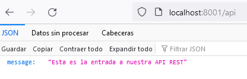


#### Preparar las respuestas JSON de la API REST
Centralizar todas las respuestas JSON, para optimizar el código. Para ello creamos dentro del directorio `src` un subdirectorio `Responses` un fichero **JsonResponse.php**
Esta clase genérica de respuesta va a trabajar con [los códigos de respuesta HTTP](https://developer.mozilla.org/es/docs/Web/HTTP/Status)
La clase a crear tiene unas constantes privadas para determinar si ha ido bien o mal, un método que evalúa si el código HTTP es correcto. Dos métodos privados que devuelven la respuesta Json en función si ha ido bien o mal , y finalmente el método público que devuelve la respuesta.

Un ejemplo del fichero **JsonResponse.php**
```php
declare(strict_types = 1);

namespace App\Responses;

final class JsonResponse
{
    //constantes para definir las distintas situaciones de la aplicación
    private const SUCCESS = 'exito';

    private const ERROR = 'error';

    // en HTTP un código de error >=400 es un error
    private static function statusByHttpCode(int $httpCode): string
    {
        if ($httpCode >= 400) {
            return self::ERROR;
        }

        return self::SUCCESS;
    }

    // en HTTP un código 204 - es sin información y un código 200 -es con éxito
    /**
     * @param array<string, mixed>|null $data
     */
    private static function success(?array $data = null): void
    {
        if (! $data) {
            response()
                ->httpCode(code: 204);
            exit;
        }

        response()
            ->httpCode(code: 200)
            ->json(value: [
                'status' => self::SUCCESS,
                'data'   => $data,
            ]);
    }

    private static function error(string $message, int $httpCode = 400): void
    {
        response()
            ->httpCode(code: $httpCode)
            ->json(value: [
                'status'  => self::ERROR,
                'message' => $message,
            ]);
    }
    // el método a utilizar que analiza la respuesta
    public static function response(?array $data = null, int $httpCode = 200): void
    {
        if (self::statusByHttpCode(httpCode: $httpCode) === self::SUCCESS) {
            self::success(data: $data);
        } else {
            self::error(message: $data['message'], httpCode: $httpCode);
        }
    }
}

```
Cambiar el fichero __ApiController.php__ para que utilice el método `response` de `JsonResponse` 
un ejemplo de llamada a esta clase es:

```php
declare(strict_types = 1);

namespace App\Controllers\Api;
use App\Responses\JsonResponse;

final class ApiController
{
    public function __invoke(): void
    {
        JsonResponse::response(
            data:[
                'producto'=> [
                    'nombre'=>'producto 1',
                    'descripcion'=>'es un producto de prueba',
                ]
                ],
            );
    }
}
```
En el navegador muestra

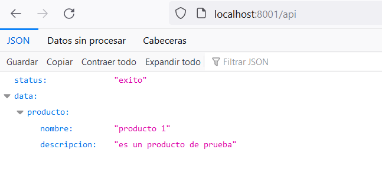

### POSTMAN 

Postman es una plataforma API para crear y utilizar API. Postman simplifica cada paso del ciclo de vida de la API y agiliza la colaboración para que puedas crear mejores API y más rápido. Información [Postman](https://www.postman.com/)
Si es la primera vez que utilizamos la plataforma tendremos que descargar el servicio `desktop agent`
Ejemplo

Crea tu primera colección en el área de trabajo creado, por ejemplo,  con nombre cursoDWES y crea tu primer punto de acceso EntradaApi, y la petición http, el resultado es:

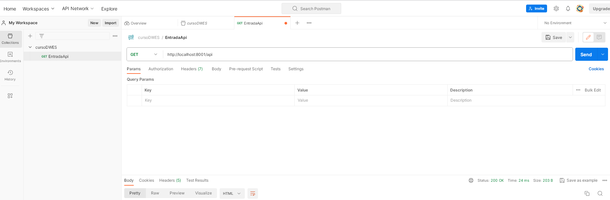

#### Configurar un entorno
las variables de entorno en Postman te permiten gestionar y utilizar de manera eficiente valores dinámicos en tus solicitudes, lo que facilita la automatización y la gestión de tus pruebas de API y peticiones.

En la opción __Environments__, nos dá la opción de crear el entorno y posteriormente crear las variables. Por ejemplo, crearemos una variable `API_URL` que contenga el valor de entrada a todas nuestras api's definidas.

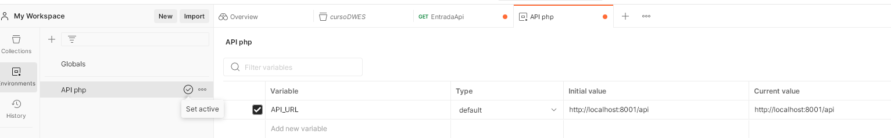

Una vez creado el entorno para poder utilizar las variables definidas es necesario __activar el entorno__
Para utilizar la variable en la petición get se encuentra entre dobles llaves

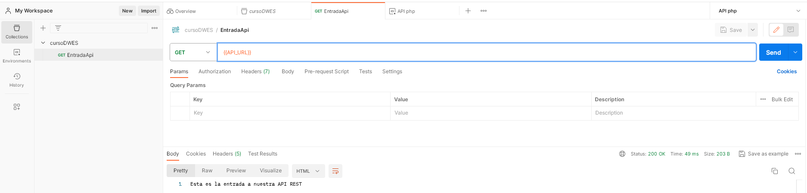


#### Crear un ejemplo de conexión a base de datos, crear una entidad con operaciones CRUD y respuestas JSON

Lo primero en el fichero `.env` vamos a crear las credenciales a la base de datos. Tiene que estar creada la base de datos

```shell
DB_DSN=mysql:host=localhost:3306;dbname=apirest;charset=utf8mb4
DB_USERNAME=root
DB_PASSWORD=

```
A continuación , creamos dentro del directorio `src` un subdirectorio `services` que contiene el fichero **DBConnection.php**, que realiza la conexión con la BD e utiliza las variables de entorno para crear que por medio de PDO realice la conexión a la base de datos

También, creamos dentro del directorio `src` un subdirectorio `Entities` donde crearemos el fichero **Producto.php**, que  es la clase de productos que tiene los métodos requeridos para realizar las siguientes tareas:
* Crear la tabla productos siempre que no exista en la base de datos, los campos será un id clave primaria y autoincrementada, nombre de 50 caracteres no nulo, la descripción con 255 caracteres no nulo, precio con 8 enteros y 2 decimales y created_at que por defecto contiene CURRENT_TIMESTAMP
* El método create que realiza la inserción del producto en la base de datos, que recibe por parámetro el array con los datos del producto que retorna un true o false de la operación
* El método get que devuelve el array de todos los productos
* El método find que busca un producto por su id, recibe por parámetro la clave del producto y devuelve un true o false.
* El método update que modifica un producto por su id, recibe por parámetro un array con los datos del producto.
* El método delete que borra un producto por su id, recibe por parámetro el id del producto a borrar.
Como ejemplo solo figura la creación de la clase con el método de creación del producto

```php
declare(strict_types = 1);

namespace APP\Entities;

use App\Services\DBConnection;
use PDO;

final class Producto
{
    private PDO $db;

    public function __construct()
    {
        $this->db = DBConnection::getInstance()->getConexion();
        $this-> createTable();
    }

    private function createTable(): void
    {
        $sql = 'CREATE TABLE IF NOT EXISTS productos (
            id INT AUTO_INCREMENT PRIMARY KEY,
            nombre VARCHAR(50) NOT NULL,
            descripcion VARCHAR(255) NOT NULL,
            precio DECIMAL(10, 2) NOT NULL,
            created_at TIMESTAMP DEFAULT CURRENT_TIMESTAMP
        )';

        $this->db->exec(statement: $sql);
    }

    /**
     * @param array<string, mixed> $data
     * @return false|string
     */
    public function create(array $data): false|string
    {
        $sql = '
            INSERT INTO productos (nombre, descripcion, precio)
            VALUES (:nombre, :descripcion, :precio)
        ';

        $stmt = $this->db->prepare(query: $sql);
        $stmt->execute(params: $data);

        return $this->db->lastInsertId();
    }
}
```
Crear un controlador para cada una de las operaciones del producto, definir un subdirectorio `Producto` dentro de `Api` y por cada una de las operaciones creamos un nuevo controlador por ejemplo creamos el fichero __CreateProductoController.php__ para la clase que crea el producto

```php
declare(strict_types = 1);

namespace App\Controllers\Api\Producto;

use App\Entities\Producto;
use App\Responses\JsonResponse;

final class CreateProductoController
{
    public function __invoke(): void
    {
        $producto = new Producto();
        $productoId = $producto->create(
            data:input()->all(),
        );

        JsonResponse::response(
            data:$producto->find(id:(int) $productoId)
        );
    }
}
```
Hay que modificar el fichero que contiene las rutas  denominado **api.php**

```php
declare(strict_types = 1);
use Pecee\SimpleRouter\SimpleRouter as Router;
use App\Controllers\Api\ApiController;
use App\Controllers\Api\Producto\CreateProductoController;

//añadimos un nuevo grupo con el prefijo productos e indicamos el espacio de nombres

Router::group(
    ['prefix' => 'api'],
    function (): void {
        Router::get('/', [ApiController::class,'__invoke']);

        Router::group(
            ['namespace' => 'Producto','prefix' => 'productos'],
            function (): void {
                Router::post('/', [CreateProductoController::class,'__invoke']);
            }
        );
    }
);
```
Para probar el funcionamiento en `Postman` creamos una nueva entrada, con los datos del producto a insertar y enviamos para obtener la respuesta

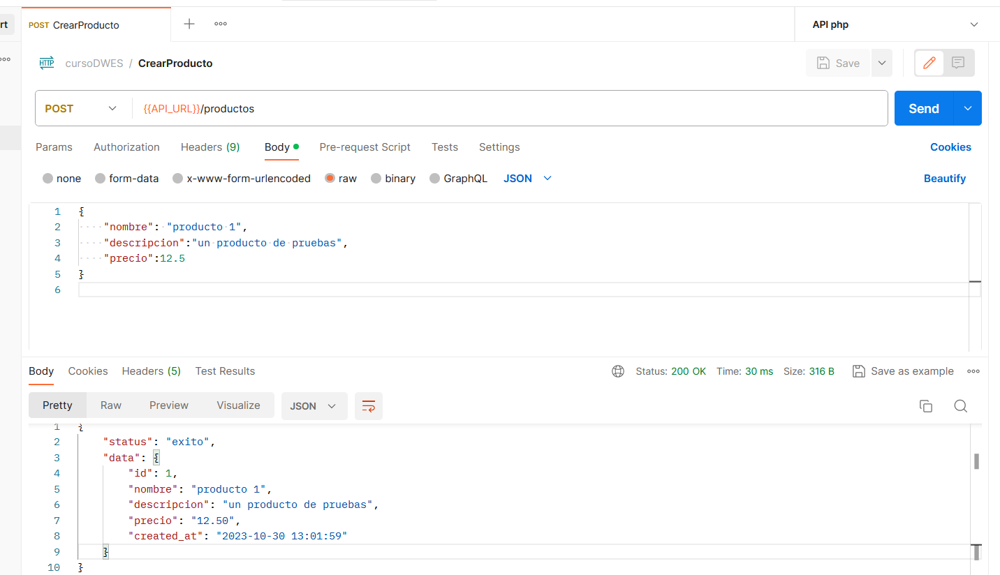

:computer: Hoja07_API_01 (ejercicio 1)

### Añadir un sistema de validación propio a la API REST

#### Crear un sistema para validar las reglas

Para  crear un sistema de reglas de validación en el directorio `src` crear un subdirectorio de reglas denominado `Rules` y dentro vamos a crear un archivo **AbstractRule** que contiene una clase abstracta que deben implementar el resto de reglas.

```php
declare(strict_types = 1);

namespace App\Rules;

abstract class AbstractRule{
    protected string $message;

    public function __construct(string $message=''){
        $this->message=$message;
    }

    public function getMessage():string{
        return $this->message;
    }

    abstract public function validate(mixed $value):bool;
}

```
Tiene un atributo `message` que es el mensaje sobre la regla a validar y un método `validate` que es el que debe definir cada una de las reglas que se quiera validar.

##### Crear las reglas de validación

Por cada regla de validación que se quiera definir se crea dentro del directorio `src` y subdirectorio `Rules`  un archivo que contenga __la regla de validación__ que se quiera definir.
En este ejemplo es la clase __RequiredRule__, que verifica si un campo es requerido o no.

```php

declare(strict_types = 1);

namespace App\Rules;

final class RequiredRule extends AbstractRule{
    
    public function validate(mixed $value):bool{
        return !empty($value);
    }

}

```
:computer: Hoja07_API_01 (ejercicio 2)

#### Crear una sistema para validar las peticiones
Para crear el sistema de peticiones en el directorio `src` crear un subdirectorio de reglas denominado `Request` y dentro vamos a crear un archivo **AbstractRequest** que contiene una clase abstracta  que define el patrón que tienen que cumplir los modelos de validación.

```php
declare(strict_types = 1);

namespace App\Request;

use App\Rules\AbstractRule;

abstract class AbstractRequest{

    //array de reglas contiene una clave por ejemplo el nombre,la descripcion 
    // array de nuestras reglas definidas required, min

    /**
     * @var array<string, array<AbstractRule>>
     */
    protected array $rules=[];

    // array de mensajes contiene un clave por ejemplo el nombre, la descripción
    // y un array de los mensajes por cada clave

    /**
     * @var array<string, array<string>>
     */

    protected array $messages=[];

    public function __construct(){
        $this->rules=$this->rules();
        $this->respond();
    }
    
    /**
     *  $return array<string,array<AbstracRule>>
     */
    abstract protected function rules():array;

    /**
     * @param array<string, mixed> $data
     */
    public function validate(array $data): bool
    {
        $this->messages = [];

        foreach ($this->rules as $field => $rules) {
            foreach ($rules as $rule) {
                if (! $rule->validate($data[$field])) {
                    if (!isset($this->messages[$field])) {
                        $this->messages[$field][] = $rule->getMessage();
                    }
                }
            }
        }

        return empty($this->messages);
    }

    /**
     * @return array<string, array<string>>
     */
    public function getMessages(): array
    {
        return $this->messages;
    }

    /**
     * @return array<string, mixed>
     */
    public function validated(): array
    {
        $data = [];

        foreach ($this->rules as $field => $rules) {
            $data[$field] = input($field);
        }

        return $data;
    }

    protected function respond(): void
    {
        if ($this->validate(data: input()->all(array_keys($this->rules))) === false) {
            $this->error();
        }
    }

    protected function error(): void
    {
        response()
            ->httpCode(code: 422)
            ->json(value: [
                'status' => 'error',
                'errors' => $this->getMessages(),
            ]);
    }

}

```

##### Crear la validación de un modelo

El modelo de ejemplo basado en la interfaz definida **AbstractRequest** es el de `Productos` donde se define el método `rules` e indicamos las reglas de validación por cada campo definido en la tabla que se quiera validar.

En este Ejemplo la clase definida **ProductoRequest**, se realizan las siguientes validaciones:
* Con respecto al nombre, se valida que sea requerido, que debe tener al menos 3 caracteres y 255 como máximo y que el valor del campo debe ser único.
* Con respecto a la descripción, se valida que sea requerido.
* Con respecto al precio, se valida que sea requerido y que sea un campo numérico.


```php
declare(strict_types = 1);

namespace App\Request;

use App\Rules\{
    MaxRule, MinRule, NumericRule, RequiredRule, UniqueRule,
};

final class ProductoRequest extends AbstractRequest
{
    public function __construct(private readonly ?int $id = null)
    {
        parent::__construct();
    }

    protected function rules(): array
    {
        return [
            'nombre' => [
                new RequiredRule(message: 'El nombre es requerido'),
                new MinRule(length: 3, message: 'El nombre debe tener como mínimo 3 caracteres'),
                new MaxRule(length:255, message: 'El nombre debe tener como máximo 255 caracteres'),
                new UniqueRule(table: 'productos', column: 'nombre', id: $this->id, message: 'El producto ya existe'),
            ],
            'descripcion' => [
                new RequiredRule(message: 'La descripción es requerida'),
            ],
            'precio' => [
                new RequiredRule(message: 'El precio es requerido'),
                new NumericRule(message: 'El precio debe ser numérico'),
            ],
        ];
    }
}

```

#### Aplicar el modelo de validación a un proceso

El ejemplo es modificar el proceso de creación de un producto donde ahora vamos a validar antes de insertar que la información cumpla una serie de condiciones que han sido definidas en __ProductoRequest__ en el método __rules()__.  Tenemos que modificar el controlador que gestiona la creación del producto **CreateProductoController**

```php
declare(strict_types = 1);

namespace App\Controllers\Api\Producto;

use App\Entities\Producto;
use App\Responses\JsonResponse;
use App\Request\ProductoRequest;

final class CreateProductoController
{
    public function __invoke(): void
    {
        $producto = new Producto();
        $request = new ProductoRequest();

        $productoId = $producto->create(
         
           data:$request->validated(),
        );


        JsonResponse::response(
            data:$producto->find(id:(int) $productoId)
        );
    }
}

```
Una prueba de validación es:

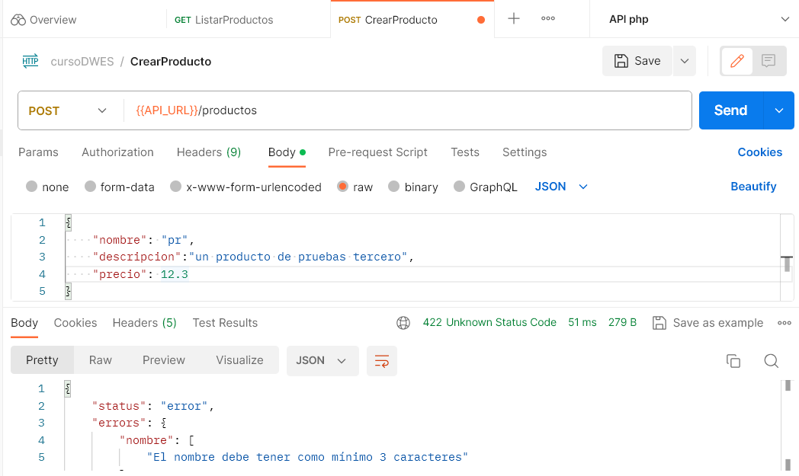

:computer: Hoja07_API_01 (ejercicio 3)


## Servicios web REST

REST es una tecnología mucho más flexible que transporta datos por medio del protocolo HTTP.

Además permite utilizar los diversos métodos que proporciona HTTP para comunicarse, como lo son GET, POST, PUT, DELETE, PATCH.

Permite transmitir prácticamente __cualquier tipo de datos__, ya que el tipo de datos está definido por el Header Content-Type, lo que nos permite mandar, XML, JSON, binarios (imágenes o documentos),  text, etc.
* La gran mayoría transmite en JSON por un motivo muy importante: JSON es interpretado de forma natural por JavaScript
  
REST es más liviano en peso y mucho más rápido en su procesamiento que SOAP.
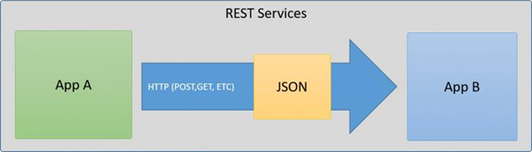

### Cliente
Para obtener los datos del un servicio web REST se utiliza la [__librería cURL__](https://www.php.net/manual/es/book.curl.php). Es una biblioteca que permite conectarse y comunicarse con diferentes tipos de servidores y diferentes tipos de protocolos:http, https, ftp, gopher, telnet, dict, file y ldap. cURL se utiliza a diario en líneas de comando o scripts para transferir datos.


Un ejemplo de una petición GET podría ser la siguiente:
```php
    $url_servicio = "http://zoologico.laravel/rest";
    $curl = curl_init($url_servicio);
    //establecemos el verbo http que queremos utilizar para la petición
    curl_setopt($curl, CURLOPT_CUSTOMREQUEST, "GET");
    curl_setopt($curl, CURLOPT_RETURNTRANSFER, true);
    $respuesta_curl = curl_exec($curl);
    curl_close($curl);	
```
* **curl_init**: Inicia una nueva sesión y devuelve el manipulador cURL para el uso de las funciones curl_setopt(), curl_exec(), y curl_close().
* **curl_setopt**: Establece una opción en la sesión del recurso cURL, opcionalmente podemos utilizar curl_setopt_array para configurar múltiples opciones.
* **curl_exec**: Ejecuta la sesión cURL que se le pasa como parámetro. Esta función debe llamarse después de inicializar una sesión cURL y todas las opciones para la sesión están establecidas.
* **curl_close**: Cierra una sesión cURL y libera todos sus recursos. El recurso cURL, $curl, también es eliminado.

Algunas opciones de configuración de **curl_setopt**:

Tiene tres parámetros:
* El recurso cURL devuelto por el curl_init();
* La opción CURLOPT_xxx a configurar
* valor a configurar de la opción

* **CURLOPT_RETURNTRANSFER**: true para devolver el resultado de la transferencia como string del valor de curl_exec() en lugar de mostrarlo directamente.
* **CURLOPT_CUSTOMREQUEST**: Esta opción es muy importante, en este caso nos permite sobrescribir el verbo HTTP utilizado para enviar una petición GET/PUT/POST/DELETE....
Hay una opción especifica para post
  *  **CURLOPT_POST**: true para hacer un HTTP POST normal. Este POST del tipo application/x-www-form-urlencoded, el más común en formularios HTML.
* **CURLOPT_POSTFIELDS**: Los campos que deseamos enviar en la petición POST

Este cliente puede ser utilizado en vez de PostMan para obtener la respuesta, para ver esa respuesta como devuelve un array de datos tendremos que realizar un __var_dump()__ para ver dicha respuesta o bien no introducir la opción CURLOPT_RETURNTRANSFER

### Servidor Laravel
En este caso en vez de crearnos toda una estructura desde cero, la idea es generar una página que devuelva una respuesta en formato JSON utilizando **Laravel** como servidor.
Para ello se puede utilizar el método __json__ de Laravel. 
Se crea un __controlador__ específico y las __rutas__ correspondientes.
Luego, en el controlador se hacen los __métodos__ necesarios para realizar todas las operaciones del servicio web.

Por ejemplo, si queremos devolver en formato JSON todos los animales  de nuestro zoologico, podemos hacer algo así:
```php
$animales=Animal::all();
return response()->json($animales);
```
Si quisiéramos enviar un mensaje lo haríamos a través de un array asociativo:
```php
return response()->json(['mensaje' => ‘El mensaje a enviar’]);
```
:computer: Hoja07_WebServices_01