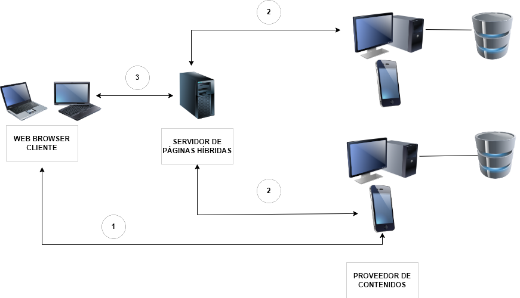
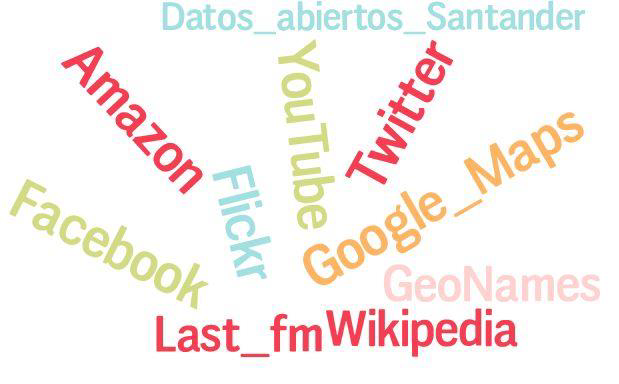

# UT8 GENERACIÓN DE PÁGINAS WEB INTERACTIVAS y UT9 DESARROLLO DE APLICACIONES WEB HÍBRIDAS

## Índice
- [UT8 GENERACIÓN DE PÁGINAS WEB INTERACTIVAS y UT9 DESARROLLO DE APLICACIONES WEB HÍBRIDAS](#ut8-generación-de-páginas-web-interactivas-y-ut9-desarrollo-de-aplicaciones-web-híbridas)
  - [Índice](#índice)
  - [Programación del cliente web](#programación-del-cliente-web)
    - [Comunicación asíncrona con el servidor web: AJAX](#comunicación-asíncrona-con-el-servidor-web-ajax)
  - [Ajax](#ajax)
  - [Reutilización de código e información](#reutilización-de-código-e-información)
  - [Arquitectura de una aplicación web híbrida](#arquitectura-de-una-aplicación-web-híbrida)
  - [Comunicación en la arquitectura mashup](#comunicación-en-la-arquitectura-mashup)
  - [Utilización de repositorios de información](#utilización-de-repositorios-de-información)

## Programación del cliente web
Muchas de las aplicaciones web que existen en la actualidad tienen dos componentes una parte de la aplicación, generalmente la que contiene la lógica de negocio, que se ejecuta en el servidor y otra parte de la aplicación, de menor peso, se ejecuta en el cliente.

Existen incluso cierto tipo de aplicaciones web, como Google Docs, en las que gran parte de las funcionalidades que ofrecen se implementan utilizando programación del cliente web.

Ahora aprenderemos a integrar estos dos componentes de una misma aplicación web: el código PHP que se ejecutará en el servidor, con el código que se enviará al cliente para que éste lo ejecute.

La etiqueta que se utiliza para integrar el código ejecutable por el navegador junto al resto de etiquetas es "script".

La ejecución de código en el navegador encaja perfectamente con cierto tipo de tareas:
 * Como comprobar y/o procesar los datos que introduce el usuario en los formularios, como paso previo a su envío al servidor web.
 * Gestionar diferentes ventanas del navegador.
 * Modificar de forma dinámica los elementos que componen la página web, ajustando sus propiedades o estilos en respuesta a la interacción del usuario.
<div class="page"/>

Por ejemplo:
```php
<form action="usuario.php" method="get" name="datos_usuario" onsubmit="return validar_email()">
<input type="text" id="email" />
</form>

//Definimos la función:
function validar_email (){
valor =document.getElementById("email").value;
pos_arroba = valor.indexOf("@");
pos_punto = valor.lastIndexOf(".");
if (pos_arroba < 1 || pos_punto < pos_arroba+2 || pos_punto+2>= valor.length ){
    alert('Dirección de correo no valida');
    return false; }
return true; }

```
El lenguaje de guiones que se utiliza mayoritariamente hoy en día para la programación de clientes web es __JavaScript__.
Su sintaxis está basada en la del lenguaje C, parecida a la que conocemos del lenguaje PHP.

Si bien, la gran mayoría de navegadores web soportan código en lenguaje JavaScript debes tener en cuenta que:

* La ejecución de JavaScript en el navegador puede haber sido deshabilitada por el usuario.
* La implementación de JavaScript puede variar de un navegador a otro. Lo mismo sucede con el interface de programación que usa JavaScript para acceder a la estructura de las páginas web el DOM. Por este motivo, hay que verificar la funcionalidad del código en diversos navegadores antes de publicarlo.
  
### Comunicación asíncrona con el servidor web: AJAX

Una de las principales causas de la evolución de JavaScript en los últimos tiempos es, sin duda, la tecnología __AJAX__.
Entre las tareas que puedes llevar a cabo gracias a AJAX están:

* Actualizar el contenido de una página web sin necesidad de recargarla

* Pedir y recibir información desde un servidor web manteniendo la página cargada en el navegador

* Enviar información de la página a un servidor web en segundo plano

## Ajax

La tecnología AJAX se utiliza desde el cliente web para permitir comunicaciones asíncronas con el servidor web, sin necesidad de recargar la página web que se muestra en el navegador. Se basa en la utilización de código en lenguaje JavaScript.

`jQuery` posee varios métodos para trabajar con Ajax. Sin embargo, todos están basados en el método __$.ajax__.

El método __$.ajax__ es configurado a través de un objeto y contiene todas las instrucciones que necesita jQuery para completar la petición. Es particularmente útil debido a que ofrece la posibilidad de especificar acciones en caso que la petición haya fallado o no.

Algunas opciones del método son:

* __url__: establece la URL en donde se realiza la petición. La opción url es obligatoria para el método $.ajax.

* __data__: establece la información que se enviará al servidor. Esta puede ser tanto un objeto como una cadena de datos (por ejemplo foo=bar&&baz=bim)

* __type__: de forma predeterminada su valor es GET. Otros tipos de peticiones también pueden ser utilizadas (como PUT y DELETE), sin embargo pueden no estar soportados por todos los navegadores.

* __dataType__: establece el tipo de información que se espera recibir como respuesta del servidor. Si no se especifica ningún valor, de forma predeterminada, jQuery revisa el tipo de MIME que posee la respuesta.

* __success__: establece una función a ejecutar si la petición a sido satisfactoria. Dicha función recibe como argumentos la información de la petición (convertida a objeto JavaScript en el caso que dataType sea JSON), el estatus de la misma y el objeto de la petición en crudo.

* __error__: establece una función de devolución de llamada a ejecutar si resulta algún error en la petición. Dicha función recibe como argumentos el objeto de la petición en crudo y el código de estatus de la misma petición. Ejemplo:

```javaScript
<script>
    $(document).ready(function(){
        $("button[name='add']").click(function(){
            $.ajax({
                type: "POST",
                url: "index.php?option=productos",
                dataType: "json",
                data: {"accion":"add","producto":this.id},
                success : function(data){
                    $("#cesta").html(data.contenido_cesta);
                    $("#botonVaciar").prop('disabled',data.botones);
                    $("#botonComprar").prop('disabled',data.botones);
                }
            });
            window.location="index.php?option=productos";
        });
    });
    //... debajo se prodría realizar el de borrar y por último , se cerraria el script
</script>
//Otro  ejemplo puede ser el buscador :

<script>
    $(document).ready(function(){
        $("#resultadoBusqueda").html('<p>Buscador</p>');
    });
    function buscar(){
        var textoBusqueda=$("input#busqueda").val();
        if (textoBusqueda !=""){
            $.post("index.php?option=buscador",{valorBusqueda:textoBusqueda},function(mensaje){
                $("#resultadoBusqueda").html(mensaje);
            });
        } else{
            $("#resultadoBusqueda").html('<p>JQUERY VACIO</p>');
        };
    };
</script>

```
Para comunicarse con el servidor, se puede utilizar la notación __JSON__. Json es un formato de intercambio de información más sencillo de procesar que XML (especialmente al utilizar el lenguaje JavaScript) para transmitir la información con el servidor

:computer: Hoja08_AJAX_01
:computer: Hoja08_AJAX_02 Laravel

## Reutilización de código e información
Los servicios web permiten a tus aplicaciones comunicarse con otras utilizando la web (el protocolo HTTP) como medio de transmisión.
En la UT 7 hemos visto servicios SOAP y los servicios REST. La mayoría de las APIs existentes en el mercado utilizan estos últimos.

Un servicio web implementado mediante REST puede:

* Utilizar una estructura de URIs para acceder a los recursos gestionables mediante el servicio web
  * http://miweb.com/productos
  * http://miweb.com/productos?id=1
  
* Usar los distintos métodos HTTP ( POST, DELETE,...)
* Utilizar XML o JSON en sus comunicaciones (o incluso ambos)
* En esta unidad habrá que crear aplicaciones utilizando diversos servicios web

¿Y cómo consumíamos estos servicios web REST? Para obtener los datos del un servicio web REST vamos a
utilizar la librería __cURL__.

Es una biblioteca que permite conectarse y comunicarse con diferentes tipos de servidores y diferentes tipos de protocolos.

__Una aplicación web híbrida o mashup__ implica que debe acceder a datos o procesar información a través del sitio que nos ofrece el proveedor, ya que este servicio de nuestro proveedor nos va a dar un valor añadido a nuestra aplicación, y sin esta ayuda sería técnicamente imposible ofrecer estos servicios.

<div class="page"/>

Un ejemplo ya visto era el siguiente:
```php
    $url_servicio = "http://zoologico.laravel/rest";
    $curl = curl_init($url_servicio);
    //establecemos el verbo http que queremos utilizar para la petición
    curl_setopt($curl, CURLOPT_CUSTOMREQUEST, "GET");
    curl_setopt($curl, CURLOPT_RETURNTRANSFER, true);
    $respuesta_curl = curl_exec($curl);
    curl_close($curl);
	
    $respuesta_decodificada = json_decode($respuesta_curl);
```

## Arquitectura de una aplicación web híbrida

La arquitectura de una aplicación web híbrida está compuesta por tres partes principales. Por un lado, lo más importante es el __proveedor de contenidos__ que ofrece servicios como mapas, geolocalizaciones, API para conectar con los servicios de AdWords o transcripciones de audio a texto, como es el gran y todo poderoso Google. En el centro estaría situado __el servidor__ de la nueva página híbrida y por último, __el cliente__, que es quien accede a la página.

* __Proveedor de contenidos__ Es la fuente de datos. Los datos suelen estar disponibles a través de una interfaz pública o utilizando una API con diferentes protocolos como RSS o ATOM o servicios Web.
  
* __Sitio Mashup__: es la aplicacion nueva que provee de un nuevo servicio utilizando diferentes fuentes de información de las que no es dueño. El sitio mashup hará uso de las tecnologías de las que disponga el proveedor de contenidos para conseguir generar la aplicación híbrida.
  
* __Cliente Web__: es la interfaz del usuario del mashup. Es una aplicación web. Aqui el contenido también puede ser mezclado en el mismo navegador del cliente. Se pueden utilizar lenguajes como JavaScript y AJAX.

## Comunicación en la arquitectura mashup

Vamos a ver el esquema de las diferentes vías de comunicación entre el navegador web del cliente y el proveedor de contenidos, pasando o no por el servidor de aplicaciones o páginas híbridas.
* 1 - el navegador cliente accede directamente a la información del proveedor de contenidos mediante JavaScript
* 2 - el servidor de aplicaciones obtiene los datos directamente del proveedor de contenidos; estos se mezclan en el servidor y son enviaddos al navegador del cliente.
* 3 - el navegador del cliente accede al servidor web y extrae el contenido almacenado.
  
  

## Utilización de repositorios de información

Para utilizar servicios de terceros, hay condiciones y limites. Por ejemplo, a partir de un cierto número de peticiones, ya nos empezarían a facturar: un ejemplo podría ser el servicio de Google de geolocalización, que tiene un límite de 1500 peticiones.

La mayoría de los proveedores de servicios web utilizan un protocolo llamado OAuth. Es un protocolo estándar de autorización.
__OAuth2__, permite a una aplicación externa obtener acceso a información de carácter privado de un tercero a través de un servicio Web. Para ello establece un acuerdo de acceso a ella entre la aplicación externa, el servicio web y el propietario de los datos a los que se solicita el acceso.

Por ejemplo, si una aplicación 'X' solicita a Google acceso a los calendarios del usuario dwes, Google pedirá a dwes permiso indicándole qué aplicación es la que solicita el acceso y a qué información. Si el usuario dwes otorga permiso, la aplicación 'X' podrá acceder a los datos que solicitó a través del servicio de Google.

Veamos, por ejemplo, qué sucede cuando nuestra aplicación necesita acceder a la información personal del usuario a través del Servicio de Google Tasks. En este caso, los pasos que se seguirán son los siguientes:

* La aplicación web se comunica con el servidor de autorización OAuth2, indicando la información a la que quiere acceder y el tipo de acceso a esta.
* El servidor de autorización requiere al usuario de la aplicación web que inicie sesión con su cuenta Google (si aún no lo ha hecho), y lo redirige a una página en la que le pide su consentimiento para otorgar acceso a su información privada.
* Si el usuario da su consentimiento, el servidor de autorización OAuth2 devuelve a la aplicación web un código de autorización.
* Los códigos de acceso tienen un tiempo de vida limitado. Cuando caducan, la aplicación ha de comunicarse de nuevo con el servidor de autorización para obtener un código de refresco.

Además, la mayoría de la información que nos suministran los proveedores de servicios web viene en formato XML y JSON.

Un ejemplo de aplicación web híbrida, es una aplicación que utilice la API de Google Maps y muestre información de ubicación geográfica de las franquicias de una empresa para mostrar la localización de las tiendas en un mapa.

 

Otro ejemplo podría ser una aplicación que lea distintos RSS de periódicos (Washington Post, Reuters, CNN, BBC, Yahoo News...) y se conecte a Calais para obtener de cada uno de los ítems ciudades y países que se citen en ellos.
Una vez obtenidas las ciudades y países, se utilizaría la API de Google Maps para posicionar cada una de las ciudades o países de los que se hayan encontrado noticias. En caso de que se pinche en cada marca del mapa se cargarían las noticias relacionadas con esta ciudad y utilizando Flickr se obtendrían 2 fotografías de este lugar.

Podeís encontrar información sobre apis en  el siguiente artículo de [NORDIC APIS](https://nordicapis.com/13-api-directories-to-help-you-discover-apis/)

Obtener una api key de google maps en el siguiente artículo de [Maplink](https://maplink.global/blog/es/como-obtener-google-maps-api-key/)

Información [Google Maps Platform](https://developers.google.com/maps?hl=es-419)

Documentación sobre [Amazon API Gateway](https://aws.amazon.com/es/api-gateway/)

Documentación de la [API de Flickr](https://www.flickr.com/services/api/)

Documentación de la [API de YouTube](https://developers.google.com/youtube/v3)
<div class="page"/>

Ejemplo:
Utilización de Google Api para obtener la dirección a partir de las coordenas de latitud y longitud
mirar [artículo de firefox](https://developer.mozilla.org/es/docs/Web/API/Geolocation_API)

```html
<!DOCTYPE html>
<html>
    <head>
        <meta charset="utf-8">
    </head>
    <body>
        <p> Pincha el botón para conseguir tus coordenadas </p>
        <button onclick="getlocation()">Inténtalo</button>
        <p id="demo"></p>
        <script>
            var x=document.getElementById("demo");
            function getlocation(){
                if(navigator.geolocation){
                    navigator.geolocation.getCurrentPosition(showPosition);
                }
                else {
                    x.innerHTML="Geolocation no está soportada por este navegador.";
                }
            }
            function showPosition(position){
                x.innerHTML="Latitud" + position.coords.latitude +
                "<br />Longitud" +position.coords.longitude;
            }
        </script>
    </body>
</html>
```
Propuesta realizar una función que a partir de la latitud y longitud, nos dé los siguientes datos: población, código postal, calle, número y comunidad.

:computer: Hoja09_Mashup_01
